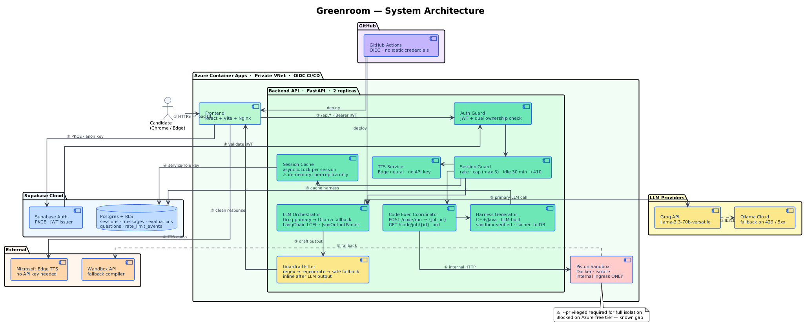
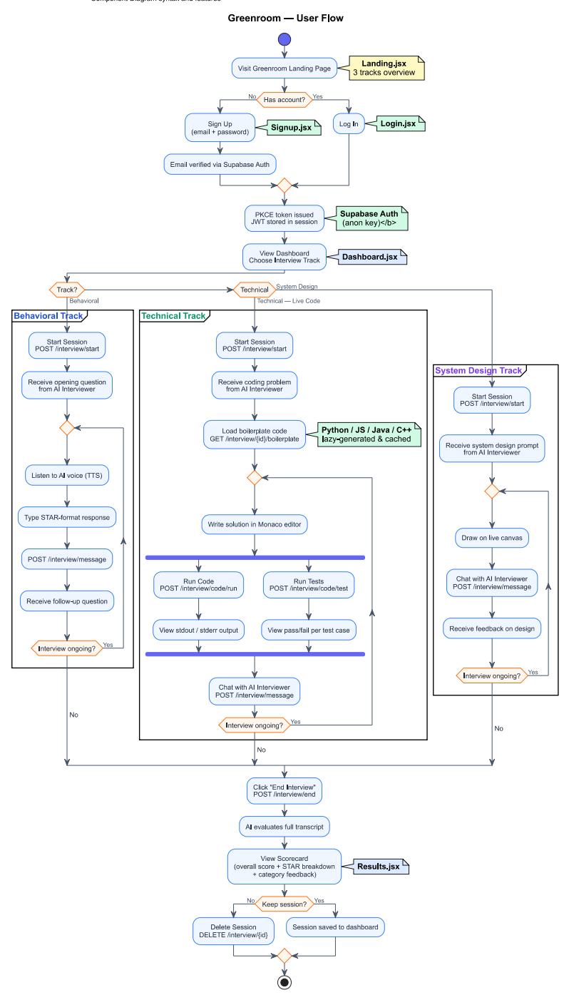
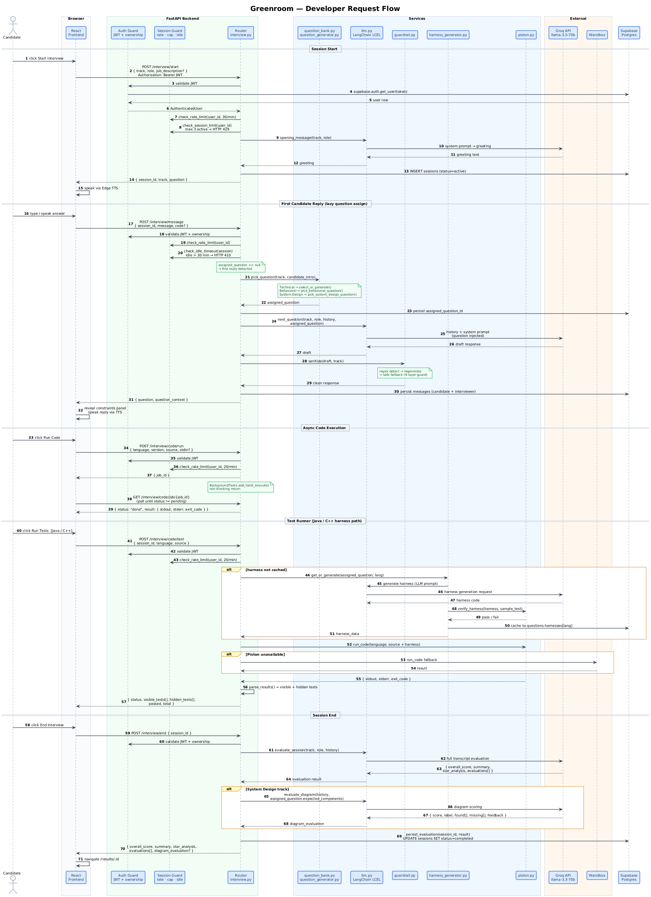

# Greenroom: Technical Design Document

**Authors:** Vishwajeet, Geet, Anurag, Nithin, Mahati, Yuang
**Version:** 4.0 · July 2026
**Status:** Active
**Live app:** https://greenroom-frontend.orangeground-05e56063.swedencentral.azurecontainerapps.io

---

## 1. Overview

### 1.1 Problem Statement

Students and early-career candidates have no free, realistic way to practice interviews with structured feedback. Existing options each miss a key dimension:

| Option | Gap |
|---|---|
| Human mock interviews | Hard to schedule, inconsistent scoring, often cost money |
| Static Q&A tools | No adaptive follow-up, no voice, no live coding |
| General AI chatbots | No interview structure, no scoring rubric, no STAR evaluation |

Greenroom fills this gap: an AI-driven interview platform that speaks out loud, runs code live, scores system-design diagrams, and delivers a structured STAR evaluation at zero cost to the candidate.

### 1.2 Goals

| Goal | Measure |
|---|---|
| Realistic AI-driven interview | Candidate completes a full session end-to-end: voice, adaptive follow-ups, scored report |
| STAR-based evaluation | Per-dimension STAR scores and improvement points on every session |
| Three interview tracks | Behavioral (STAR Q&A), Technical (live code execution), System Design (canvas + diagram scoring) |
| Curated question bank | 357 questions across all tracks, each with structured metadata |
| Free infrastructure | Zero recurring cost on Azure for Students credits |

### 1.3 Non-Goals

- Seniority level differentiation (Entry / Senior)
- Role-specific question sets beyond Software Engineer (PM, Data Science, DevOps)
- Evaluation accuracy benchmarking against human raters
- Native mobile clients

---

## 2. Architecture

Greenroom is a three-service web application. The candidate interacts through a browser. The backend handles all intelligence: LLM calls, code execution, evaluation, and session management. Supabase provides authentication and persistent storage.

### 2.1 System Architecture



> **Color guide:** Blue = core services, Green = Azure backend, Yellow = guardrail / LLM providers, Orange = external execution and TTS, Red = Piston sandbox (internal only), Purple = CI/CD

### 2.2 User Flow



### 2.3 Developer Request Flow



### 2.4 Request Lifecycle

A complete session moves through the following steps:

1. **Authentication.** The candidate logs in via email/password. Supabase handles PKCE flow and no credentials touch the backend code. The browser receives a JWT.

2. **Session start.** The frontend sends `POST /api/interview/start` with a Bearer JWT. The backend validates the token server-side against Supabase, enforces the session concurrency cap (max 3 active per user), generates an opening greeting via the LLM, and returns `{session_id, question}`.

3. **Interview loop.** On each turn the candidate speaks or types a reply; the frontend sends `POST /api/interview/message`. The backend checks the idle timeout (30 min, 410), assigns a question from the bank on the first reply (lazy assignment), calls the LLM, passes the response through the guardrail filter, and returns the interviewer's next question as text. The frontend speaks the reply via the TTS endpoint.

4. **Technical track.** The candidate writes code in a Monaco editor. `POST /api/interview/code/run` enqueues execution and returns a `job_id` immediately; the frontend polls `GET /api/interview/code/job/{id}`. For Java/C++, a test harness is generated on first request via the LLM, verified in the sandbox, and cached. `POST /api/interview/code/test` runs the harness and returns per-case results.

5. **System Design track.** Each message automatically serialises the Excalidraw canvas into a structured text description appended to the message body, so the AI interviewer can comment on the diagram in real time.

6. **Session end.** `POST /api/interview/end` sends the full transcript to the LLM for evaluation. For system-design sessions, a second LLM call scores the candidate's diagram against the question's `expected_components`. The backend persists all scores and returns a structured scorecard.

---

## 3. Key Design Decisions

### LangChain LCEL chains

All LLM interactions use LangChain Expression Language rather than plain API calls. LCEL chains inject the full typed conversation history (`AIMessage` / `HumanMessage`) on every request via `MessagesPlaceholder`. `JsonOutputParser` validates LLM output against a Pydantic schema at parse time. Swapping the LLM provider requires changing one line.

| Dimension | Plain API call | Greenroom (LCEL) |
|---|---|---|
| Conversation memory | Single turn only | Full typed history injected automatically |
| Output validation | None | Pydantic schema enforced at parse time |
| Provider swap | Rewrite every call site | One line: `ChatGroq(...)` to `ChatOpenAI(...)` |
| LLM fallback | None | Auto-retry on Ollama Cloud on 429 / 5xx |

### Lazy question assignment

Questions are assigned on the first candidate message, not when the session starts. This allows the LLM to use the candidate's self-introduction to select the most contextually appropriate question from the bank. The assignment is persisted to Supabase and injected into every subsequent LLM call.

```
POST /interview/start        ->  greeting only; assigned_question = null
POST /interview/message (1)  ->  pick_question(track, intro) -> inject into system prompt
POST /interview/message (2+) ->  question already present in session state
```

### Postgres-backed rate limiter

The rate limiter uses a `rate_limit_events` table in Supabase, with one row per request pruned after five minutes. Every backend replica queries the same Postgres instance, so the limit is truly per-user across the fleet. It falls back to an in-memory deque if the table does not exist, with a try/except guard so a missing migration never crashes the backend.

| Dimension | In-memory | Postgres-backed |
|---|---|---|
| Multi-replica correctness | Silently doubles at 2 replicas | Single shared counter across all replicas |
| Persistence across restart | Lost | Survives restarts |
| Local dev without DB | Only mode | Auto-fallback |

### Session concurrency cap and idle timeout

Two independent session-level guards in `session_guard.py`:

- **Concurrency cap:** `check_session_limit()` counts `sessions WHERE status='active' AND user_id=?`. Returns HTTP 429 if >= 3. Configurable via `MAX_ACTIVE_SESSIONS`.
- **Idle timeout:** `check_idle_timeout()` compares `last_activity_at` against `now()`. Returns HTTP 410 if > 30 minutes idle. Configurable via `SESSION_IDLE_TIMEOUT_MINUTES`.

Both run on every `/message` call after JWT validation, before the LLM call.

### Self-hosted Piston with Wandbox fallback

The public Piston API requires authentication. Piston is self-hosted as an internal Azure Container App with no public internet ingress; only the backend API can reach it. Wandbox is wired as a transparent fallback; responses are normalised to Piston's response shape so no other layer knows which tier handled the request.

```
POST /api/interview/code/run
  -> Tier 1: Self-hosted Piston  (internal Container App)
      if unavailable -> fall through
  -> Tier 2: Wandbox  (public API, no auth)
      if unavailable -> fall through
  -> Tier 3: "Temporarily unavailable" message to candidate
```

### Async code execution job queue

Code execution is decoupled from the HTTP request cycle. `POST /code/run` enqueues the job via FastAPI `BackgroundTasks` and returns `{job_id}` immediately. The frontend polls `GET /code/job/{id}` until `status` is `done` or `error`. This prevents long compilations from holding HTTP connections open and avoids Azure gateway timeouts.

### Dynamic test runner: two modes

The test runner handles both problem formats present in the question bank:

- **call/expected** (LeetCode-style): The LLM provides test *data* (JSON), not runnable code. The data is injected into a harness template controlled by the backend.
  ```json
  [{"call": "two_sum([2,7,11,15], 9)", "expected": "[0, 1]"}]
  ```
- **stdin/stdout** (Codeforces-style): The candidate's raw source is the program. Each test case provides `stdin`; stdout is compared against expected output. All languages Piston supports are valid with no whitelist.

### Lazy harness generation for Java and C++

Java and C++ require a full compilable harness: imports, main, type-safe assertions. On first request the backend prompts the LLM to generate three sections (boilerplate, reference solution, test harness), runs the reference solution through the sandbox to verify all test cases pass, then caches the result under `questions.harnesses[language]` in Supabase. Subsequent requests for the same problem and language hit the cache immediately. If verification fails the harness is not cached, and the response is marked `error_type: "transient"` so the frontend suggests retrying.

### Four-layer guardrail against answer leaks

The AI interviewer must never reveal the answer or optimal complexity. Four independent layers enforce this:

1. **Prompt hardening:** Track personas explicitly forbid stating time/space complexity or recommending specific algorithms.
2. **Regex detection:** Patterns catch common leak signals the model still produces (e.g. "O(n)", "time complexity is", "you should use a hashmap").
3. **Regeneration:** On detection, the response is regenerated with a corrective instruction: "your previous draft leaked the answer, rewrite it so it only asks a question."
4. **Safe fallback:** If the regenerated response still leaks, a pre-written safe question replaces it entirely.

### JWT + RLS: three ownership verification layers

Every request passes through three independent ownership verifications:

1. `auth.py` validates the JWT via `supabase.auth.get_user(token)`, always server-side, never decoded locally.
2. `check_ownership()` in `session_guard.py` compares `session.user_id` against the authenticated user's ID.
3. Postgres RLS policies enforce the same ownership rule independently at the database level.

Even if application code contained a bug, the database would not return another user's rows.

### Two-key architecture

The frontend holds only the Supabase **anon key** (safe to expose, used for PKCE login). The backend holds the **service-role key** (secret, injected via environment variable at deploy time, never sent to the browser). The service-role key bypasses RLS so the backend can write on behalf of any user, but it is never exposed outside the server process.

### Diagram evaluation: system-design track

When a system-design session ends, `llm.evaluate_diagram()` scores the candidate's Excalidraw canvas against the `expected_components` list on the assigned question. The LLM returns structured JSON: components found, components missing, proximity score (0-10), label, and one-sentence feedback. The Results page renders this as a dedicated Architecture Diagram card with a colour-coded component checklist.

---

## 4. Scope

### Implemented

- **Behavioral track:** multi-turn STAR-format Q&A with TTS voice; question assigned from the bank on first reply via `pick_behavioral_question()`
- **Technical track:** Monaco editor, async code execution (Python, JS, Java, C++), dynamic test runner (call/expected + stdin/stdout), lazy Java/C++ harness generation, constraints panel, all languages supported for stdio problems
- **System Design track:** Excalidraw canvas with real-time serialisation; diagram scoring at session end against `expected_components`
- **Session management:** concurrency cap (max 3, HTTP 429), idle timeout (30 min, HTTP 410), session history and delete
- **Question bank:** 357 questions total:
  - 295 technical: LeetCodeDataset (Kaggle / newfacade, MIT) + CodeContests (DeepMind, CC-BY-4.0) + 8 hand-written; all constraints filled
  - 42 behavioral: `ashishps1/awesome-behavioral-interviews`; each with `expected_elements` (STAR components)
  - 20 system-design: `donnemartin/system-design-primer`; each with `expected_components` for diagram scoring
- **LLM pipeline:** Groq (Llama 3.3 70B) primary with Ollama Cloud fallback; LangChain LCEL chains; four-layer guardrail
- **Code execution:** self-hosted Piston (internal) with Wandbox fallback; async job queue
- **Auth:** Supabase email/password + PKCE OAuth; JWT validated server-side on every request; Postgres RLS
- **Rate limiter:** Postgres sliding-window (30 req/min standard, 20 req/min code), in-memory fallback
- **Observability:** structured JSON logging via `structlog`; GitHub Actions CI/CD (lint, type-check, pytest, Vitest)

### Known infrastructure constraints

- **Piston sandbox:** Azure Container Apps free consumption plan blocks `--privileged` Docker mode, which Piston's `isolate` sandbox requires for full namespace-based process isolation. Wandbox handles fallback execution. Full isolation requires a dedicated D4 workload profile (~$50/month) or replacing isolate with gVisor/nsjail.
- **Supabase free tier:** 500 MB storage, 2 connections/second ceiling.
- **Web Speech API:** browser speech recognition only works in Chrome and Edge, and requires HTTPS in production.

---

## 5. Security

**Controls in place:**

- Every request validated server-side via `supabase.auth.get_user(token)`; JWT never decoded locally
- Session ownership checked in application code (`check_ownership`) and independently enforced by Postgres RLS policies
- All inputs validated by Pydantic before any business logic runs: 100 KB max source code, 20 KB max message, 2,000 chars max TTS text, 50 chars max language/version strings
- No SQL injection surface; all database queries use the Supabase SDK's parameterized methods
- Secrets only in environment variables, confirmed by code grep and CI fitness function; nothing hardcoded
- CORS locked to the deployed frontend origin via `ALLOWED_ORIGINS`
- Piston has internal-only ingress, not reachable from the internet; only the backend container can call it
- Four-layer guardrail prevents the LLM from leaking problem answers or optimal solutions
- CI/CD uses OIDC federated identity; no Azure credentials stored as repository secrets
- Architecture fitness function in CI checks: frontend never imports `SERVICE_ROLE_KEY`; every session endpoint calls `check_ownership`

**Known gap: Piston sandbox isolation**

Piston's `isolate` backend requires `--privileged` Docker mode for full namespace-based process isolation, which Azure Container Apps free tier blocks. In practice, Wandbox handles the majority of code execution on its own isolated infrastructure. For a production fix: replace `isolate` with gVisor or nsjail (neither requires `--privileged`), or upgrade to an ACA dedicated D4 workload profile.

---

## 6. Testing and Observability

### Testing

| Layer | Coverage |
|---|---|
| `pytest` unit tests | Guardrail logic, Pydantic model validation, rate limiter behaviour |
| Architecture fitness functions | Frontend never imports `SERVICE_ROLE_KEY`; `supabaseClient` does not reference service-role credentials |
| `Vitest` frontend tests | API module surface contracts; security boundary check |
| CI gate | Lint (ruff, eslint), type-check (mypy, tsc), pytest, Vitest — all blocking. `deploy-containers.yml` triggers off `ci.yml`'s completion and only proceeds if it succeeded. |

Planned additions: `httpx.AsyncClient` integration tests covering endpoint ownership checks, rate limiter boundaries, and Pydantic validation edge cases; expanded Vitest coverage for hooks and components.

### Observability

Current: structured JSON logging via `structlog` per LLM call, capturing track, latency_ms, and provider (groq/fallback).

Planned additions:

- Per-request log: endpoint, latency, LLM provider, execution tier, error type; no tokens, message content, or source code logged
- Sentry free tier for error tracking
- Key metrics via Azure Log Analytics: session completion rate, LLM fallback rate, Piston vs Wandbox split, guardrail trigger rate, p95 latency on `/interview/message` and `/interview/code/test`

**Privacy:** Candidates can delete all session data at any time via `DELETE /api/interview/{id}`. When Piston is unavailable, source code is sent to Wandbox; this is disclosed. No PII is logged.

---

## 7. Deployment

### Service URLs

```
Frontend   https://greenroom-frontend.orangeground-05e56063.swedencentral.azurecontainerapps.io
API        https://greenroom-api.orangeground-05e56063.swedencentral.azurecontainerapps.io
Piston     http://greenroom-piston.internal  (internal only, no public ingress)
```

### CI/CD Pipeline

`.github/workflows/ci.yml` runs on every push/PR to `main`, gated per-side by
changed paths: lint (ruff / eslint), type-check (mypy, tsc), pytest, Vitest.

`.github/workflows/deploy-containers.yml` triggers via `workflow_run` once
`ci.yml` *completes on `main`*, and gates on its `conclusion == 'success'` —
a failing CI run no longer reaches production:

1. Builds all three images (API, Piston, frontend) — `workflow_run` doesn't
   carry per-push changed-paths info the way `push` events do, so unlike
   `ci.yml` this isn't (yet) filtered to only the service(s) that changed;
   Docker layer caching keeps an unaffected rebuild cheap
2. Docker Buildx builds each image targeting `linux/amd64`
3. Images pushed to GitHub Container Registry (`ghcr.io`) tagged with commit SHA and `latest`
4. Azure authentication via OIDC federated identity; no credentials stored in GitHub
5. `az containerapp update` applied to all three services, pointing each at its new image tag
6. Post-deploy smoke test hits `/api/health` to confirm the new API revision is actually healthy

### Container Resources

| Container | CPU | Memory | Min replicas | Max replicas |
|---|---|---|---|---|
| Backend API | 0.5 vCPU | 1.0 Gi | 0 | 2 |
| Piston | 1.0 vCPU | 2.0 Gi | 0 | 1 |
| Frontend | 0.25 vCPU | 0.5 Gi | 0 | 2 |

### Rollback

```bash
az containerapp update \
  --name greenroom-api \
  --resource-group <rg> \
  --image ghcr.io/vishwajeetraut/greenroom-api:<previous-sha>
```

### Environment Variables

**Backend:**
```
GROQ_API_KEY=                          # https://console.groq.com/keys
GROQ_MODEL=llama-3.3-70b-versatile
SUPABASE_URL=https://...
SUPABASE_SERVICE_ROLE_KEY=...          # Server-only, never expose to frontend
FALLBACK_BASE_URL=https://api.ollama.ai/v1   # Optional, Ollama Cloud
FALLBACK_API_KEY=...                   # Optional
FALLBACK_MODEL=llama3.3:70b            # Optional
ALLOWED_ORIGINS=https://greenroom-frontend...azurecontainerapps.io
MAX_ACTIVE_SESSIONS=3                  # Default: 3
SESSION_IDLE_TIMEOUT_MINUTES=30        # Default: 30
```

**Frontend:**
```
VITE_SUPABASE_URL=https://...
VITE_SUPABASE_ANON_KEY=...             # Public key, safe to expose
VITE_API_URL=/api
```

---

## 8. Open Risks

| Risk | Mitigation |
|---|---|
| Piston `--privileged` blocked on Azure free tier | Wandbox fallback active; gVisor/nsjail or D4 workload profile for full isolation |
| Groq rate-limited during peak usage | Ollama Cloud fallback implemented and tested |
| LLM returns invalid JSON despite json_mode | `JsonOutputParser` + safe default evaluation object on parse failure |
| Wandbox unavailable | "Temporarily unavailable" message; session continues without code execution |
| Cross-replica session miss | Sticky sessions as interim; Redis as proper resolution |
| Session state lost on backend restart | In-memory `SESSIONS` cache; Redis resolves permanently |
| Java/C++ harness generation slow on first use | Loading hint shown after 5 s; `error_type: transient` returned so candidate can retry |
| Web Speech API incompatible on Safari / Firefox | Documented requirement: Chrome or Edge + HTTPS |
| Supabase free tier connection ceiling | Batching or upgraded plan |
| Question bank licensing | Only public datasets with explicit licences; no scraping |

---

## 9. References

| Resource | Link |
|---|---|
| GitHub | https://github.com/VishwajeetRaut/greenroom |
| LangChain LCEL | https://python.langchain.com/docs/expression_language |
| Piston (self-host) | https://github.com/engineer-man/piston |
| Wandbox | https://wandbox.org |
| Excalidraw | https://github.com/excalidraw/excalidraw |
| Groq | https://console.groq.com |
| Ollama Cloud | https://ollama.com |
| Supabase | https://supabase.com |
| Azure for Students | https://azure.microsoft.com/en-us/free/students |
| awesome-behavioral-interviews | https://github.com/ashishps1/awesome-behavioral-interviews |
| system-design-primer | https://github.com/donnemartin/system-design-primer |
| LeetCodeDataset (Kaggle) | https://www.kaggle.com/datasets/newfacade/leetcode-dataset |
| LeetCodeDataset (arXiv) | https://arxiv.org/abs/2504.14655 |

---

## Appendix A: Code Structure

```
backend/
  main.py                    # FastAPI app, CORS middleware, router registration, structured logging
  auth.py                    # JWT extraction via Supabase, returns AuthenticatedUser
  models.py                  # Pydantic request/response schemas with field constraints
  routers/
    interview.py             # All interview endpoints: start, message, code/run, code/test, boilerplate, end, delete
    tts.py                   # TTS endpoint
  services/
    llm.py                   # LangChain LCEL chains: opening_message, next_question, evaluate_session, evaluate_diagram
    piston.py                # run_code(): Piston primary -> Wandbox fallback
    rate_limit.py            # Sliding-window per-user rate limiter: Postgres primary, in-memory fallback
    session_store.py         # In-memory SESSIONS dict with asyncio lock and idle eviction
    session_guard.py         # check_ownership, check_session_limit (max 3), check_idle_timeout (30 min)
    persistence.py           # Supabase writes: session start, messages, assigned_question, evaluation
    job_store.py             # Async code execution job queue with TTL eviction
    question_bank.py         # 357 questions: Supabase-first load with local JSON seed fallback
    question_generator.py    # LLM selects existing or generates new problem with dual-solution verification
    test_runner.py           # call/expected and stdin/stdout test modes, harness injection
    harness_generator.py     # Lazy Java/C++ harness build via LLM, sandbox-verified, cached to Supabase
    guardrail.py             # 4-layer answer-leak prevention: prompt + regex + regeneration + fallback
    supabase_client.py       # Singleton Supabase client using service-role key
    logger.py                # structlog JSON logger
    retry.py                 # Exponential-backoff retry decorator
    tts.py                   # edge-tts wrapper -> audio/mpeg stream
  data/
    question_bank.json       # 357 questions: 295 technical + 42 behavioral + 20 system-design (local seed)
  tests/
    unit/                    # pytest: guardrail, models, rate_limit
    architecture/            # Fitness functions: security boundaries, API surface contracts

frontend/src/
  pages/
    Landing.jsx              # Public homepage: pitch, how it works, 3-track overview
    Login.jsx                # Email/password login
    Signup.jsx               # Email/password signup with confirm password + show/hide toggle
    AuthCallback.jsx         # Supabase PKCE OAuth redirect handler
    Dashboard.jsx            # Track selector, session history with score/status/delete, JD upload
    Interview.jsx            # Live interview: chat pane, Monaco editor, Excalidraw canvas, TTS
    Results.jsx              # Scorecard: overall score, STAR breakdown, category scores, diagram card, transcript
  components/
    CodeEditor.jsx           # Monaco editor with language selector, constraints panel, boilerplate fetch
    TestResultsPanel.jsx     # Visible tests (input/expected/got), hidden tests (pass/fail dots)
    SystemDesignBoard.jsx    # Excalidraw canvas with Live badge, tips bar, diagram serialisation
    AuthForm.jsx             # Shared login/signup form
    Navbar.jsx               # Top navigation
    Waveform.jsx             # Animated waveform for speech recognition indicator
  hooks/
    useInterviewSession.js   # Session init/send/end lifecycle, diagram warning, 429/410 error handling
    useCodeRunner.js         # Language state, starter code, boilerplate fetch, async test runner
    useSpeechRecognition.js  # Web Speech API wrapper
    useSpeechSynthesis.js    # TTS playback hook
  lib/
    api.ts                   # Typed REST client: attaches Bearer JWT to every request
    supabaseClient.ts        # Supabase auth client using anon key, PKCE flow
```

---

## Appendix B: Data Model

```sql
sessions (
  id                   UUID PRIMARY KEY DEFAULT gen_random_uuid(),
  user_id              UUID NOT NULL REFERENCES auth.users ON DELETE CASCADE,
  track                TEXT NOT NULL CHECK (track IN ('behavioral','technical','system-design')),
  role                 TEXT,
  status               TEXT DEFAULT 'active' CHECK (status IN ('active','completed','abandoned')),
  overall_score        INT CHECK (overall_score BETWEEN 0 AND 10),
  summary              TEXT,
  star_analysis        JSONB,   -- {situation, task, action, result, star_score, missing_elements[]}
  diagram_evaluation   JSONB,   -- {components_found[], components_missing[], proximity_score, proximity_label, feedback}
  assigned_question_id TEXT REFERENCES questions(id),
  created_at           TIMESTAMPTZ DEFAULT now(),
  ended_at             TIMESTAMPTZ,
  updated_at           TIMESTAMPTZ
)
-- Indexes: idx_sessions_user_id, idx_sessions_user_created
-- RLS: users see only their own rows

messages (
  id          BIGINT GENERATED ALWAYS AS IDENTITY PRIMARY KEY,
  session_id  UUID NOT NULL REFERENCES sessions ON DELETE CASCADE,
  role        TEXT NOT NULL CHECK (role IN ('interviewer','candidate')),
  content     TEXT NOT NULL,
  sequence_no INT,
  created_at  TIMESTAMPTZ DEFAULT now()
)
-- Index: idx_messages_session_id
-- RLS: users see only messages from their own sessions

evaluations (
  id          BIGINT GENERATED ALWAYS AS IDENTITY PRIMARY KEY,
  session_id  UUID NOT NULL REFERENCES sessions ON DELETE CASCADE,
  category    TEXT,   -- "Clarity" | "Structure" | "Confidence" | "Technical Depth"
  score       INT CHECK (score BETWEEN 0 AND 10),
  feedback    TEXT,
  created_at  TIMESTAMPTZ DEFAULT now()
)
-- Index: idx_evaluations_session_id
-- RLS: users see only evaluations from their own sessions

questions (
  id                   TEXT PRIMARY KEY,
  track                TEXT,           -- technical | behavioral | system-design
  topic                TEXT,
  difficulty           TEXT,           -- easy | medium | hard
  title                TEXT,
  prompt               TEXT,
  function_name        TEXT,           -- method name for call/expected problems
  languages            TEXT[] DEFAULT '{python}',
  tests                JSONB,          -- [{call, expected}] or [{stdin, stdout}]
  constraints          JSONB,
  examples             JSONB,
  harnesses            JSONB,          -- {java: {boilerplate, harness}, cpp: {...}}
  expected_elements    JSONB,          -- behavioral: STAR components to surface
  expected_components  JSONB,          -- system-design: architecture components for diagram scoring
  created_at           TIMESTAMPTZ DEFAULT now()
)
-- Index: idx_questions_track
-- RLS: read-only for all authenticated users

rate_limit_events (
  id       BIGSERIAL PRIMARY KEY,
  user_id  UUID NOT NULL,
  ts       TIMESTAMPTZ NOT NULL DEFAULT now()
)
-- Index: idx_rate_limit_events_user_ts ON (user_id, ts)
-- RLS: enabled
-- Rows older than 5 minutes are pruned on each rate-limit check
```

---

## Appendix C: API Reference

### Interview: `/api/interview`

| Method | Path | Rate limit | Description |
|---|---|---|---|
| `POST` | `/api/interview/start` | 30/min | Creates session, returns `{session_id, track, question}`. 429 if user has >= 3 active sessions. |
| `POST` | `/api/interview/message` | 30/min | Sends candidate message. Assigns question on first reply. Returns `{question, question_context?}`. 410 if session idle > 30 min. |
| `POST` | `/api/interview/code/run` | 20/min | Enqueues code execution. Returns `{job_id}` immediately. |
| `GET` | `/api/interview/code/job/{id}` | - | Polls job status: `{status: pending\|done\|error, result?}` |
| `POST` | `/api/interview/code/test` | 20/min | Runs test harness. Returns `{status, visible_tests[], hidden_tests[], passed, total, error_type?}` |
| `GET` | `/api/interview/{id}/boilerplate?language=` | - | Returns `{boilerplate, supported}` for the session's assigned problem in the given language. |
| `POST` | `/api/interview/end` | - | Evaluates session. For system-design: also calls `evaluate_diagram`. Returns `{overall_score, summary, star_analysis, evaluations[], diagram_evaluation?}` |
| `DELETE` | `/api/interview/{id}` | - | Deletes session and all associated messages and evaluations. |

### TTS: `/api/tts`

| Method | Path | Description |
|---|---|---|
| `GET` | `/api/tts/speak?text=` | Returns `audio/mpeg` stream via Microsoft Edge neural TTS. Text: 1-2,000 characters. |

### Health

| Method | Path | Description |
|---|---|---|
| `GET` | `/api/health` | Returns `{status: "ok"}`, used by Azure health probes. |

All endpoints except `/api/health` require `Authorization: Bearer <JWT>`.

---

## Appendix D: Error Handling Reference

| Scenario | Behaviour |
|---|---|
| Missing or expired JWT | 401; frontend redirects to login |
| Request over rate limit | 429; message shown to candidate |
| 4th concurrent session start | 429; "You have too many active sessions" |
| Session idle > 30 minutes | 410; candidate prompted to start a new session |
| Session belongs to a different user | 403 |
| Groq rate-limited or 5xx | Automatic retry on Ollama Cloud |
| Piston unavailable | Falls through to Wandbox |
| Wandbox unavailable | "Temporarily unavailable" message; session continues |
| LLM returns invalid JSON | Safe default evaluation object returned; no crash |
| Session ends with no candidate answers | Score 0 with a clear explanation; no LLM call made |
| Java/C++ harness fails verification | Not cached; `error_type: transient` returned; candidate can retry |
| LLM response leaks the answer | Regenerated once with corrective instruction; pre-written fallback if still leaks |
| `rate_limit_events` table missing | Falls back to in-memory rate limiter; no crash |
| Diagram has fewer than 2 connected components | Send blocked; candidate must dismiss warning or improve diagram |

---

## Appendix E: Azure Migration Path

Every service has a direct Azure-native equivalent. Moving is a configuration change, not an architectural rewrite.

| Current | Azure equivalent | Change required |
|---|---|---|
| Groq (Llama 3.3 70B) | Azure OpenAI GPT-4o via AI Foundry | 1 line in `llm.py` |
| Web Speech API (browser STT) | Azure Speech Services real-time STT | Replace browser STT hook |
| edge-tts | Azure Neural TTS | Update `tts.py` |
| Supabase Postgres | Azure Cosmos DB for PostgreSQL | Update connection string |
| In-memory `SESSIONS` dict | Azure Cache for Redis | Update `session_store.py` |
| Piston (Docker, internal) | Azure Container Apps Dynamic Sessions | Replace `piston.py` caller |
| Supabase Auth | Azure Active Directory B2C | Update auth client |
| ACA consumption plan (free) | ACA dedicated D4 workload profile | Enables full Piston sandbox (~$50/month) |

---

## Appendix F: Question Bank Samples

**Technical entry:**
```json
{
  "id": "two-sum",
  "track": "technical",
  "topic": "arrays",
  "difficulty": "easy",
  "title": "Two Sum",
  "prompt": "Given an array of integers `nums` and an integer `target`, return the indices of the two numbers that add up to `target`...",
  "function_name": "two_sum",
  "languages": ["python", "node"],
  "tests": [{ "call": "two_sum([2, 7, 11, 15], 9)", "expected": "[0, 1]" }],
  "constraints": ["2 <= nums.length <= 10^4", "-10^9 <= nums[i] <= 10^9", "Only one valid answer exists"],
  "examples": [{ "input": "two_sum([2, 7, 11, 15], 9)", "output": "[0, 1]", "explanation": "" }],
  "harnesses": null
}
```

**Behavioral entry:**
```json
{
  "id": "beh-conflict-disagreement-001",
  "track": "behavioral",
  "topic": "conflict-resolution",
  "difficulty": "medium",
  "title": "Handling Disagreement",
  "prompt": "Tell me about a time you disagreed with a teammate or manager. How did you handle it?",
  "expected_elements": [
    "situation describing the disagreement context",
    "your task or concern",
    "specific action taken to communicate respectfully",
    "result or resolution achieved"
  ]
}
```

**System-design entry:**
```json
{
  "id": "sd-url-shortener",
  "track": "system-design",
  "topic": "web-services",
  "difficulty": "medium",
  "title": "Design a URL Shortener",
  "prompt": "Design a URL shortening service like bit.ly...",
  "expected_components": ["load balancer", "app server", "database", "cache", "hash function"]
}
```

The first 3 test cases per problem are shown to the candidate as visible (input, expected, their output). Remaining cases run hidden (pass/fail count only). Java and C++ harnesses are generated on first request and stored in the `harnesses` field once verified.

---

*Greenroom v4.0 · July 2026*
