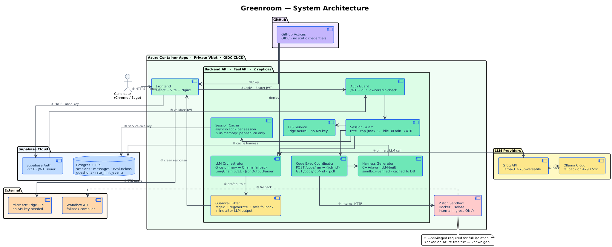
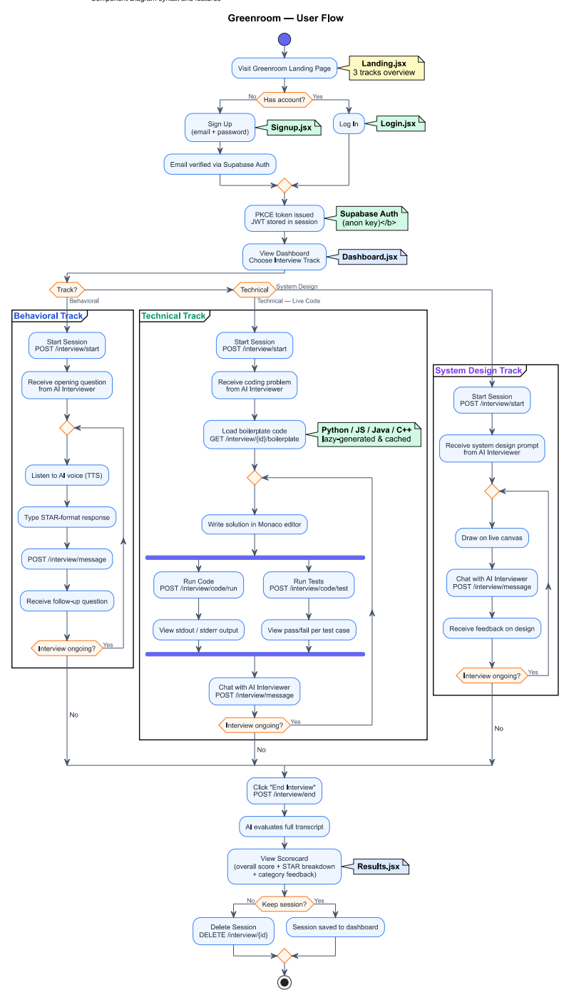
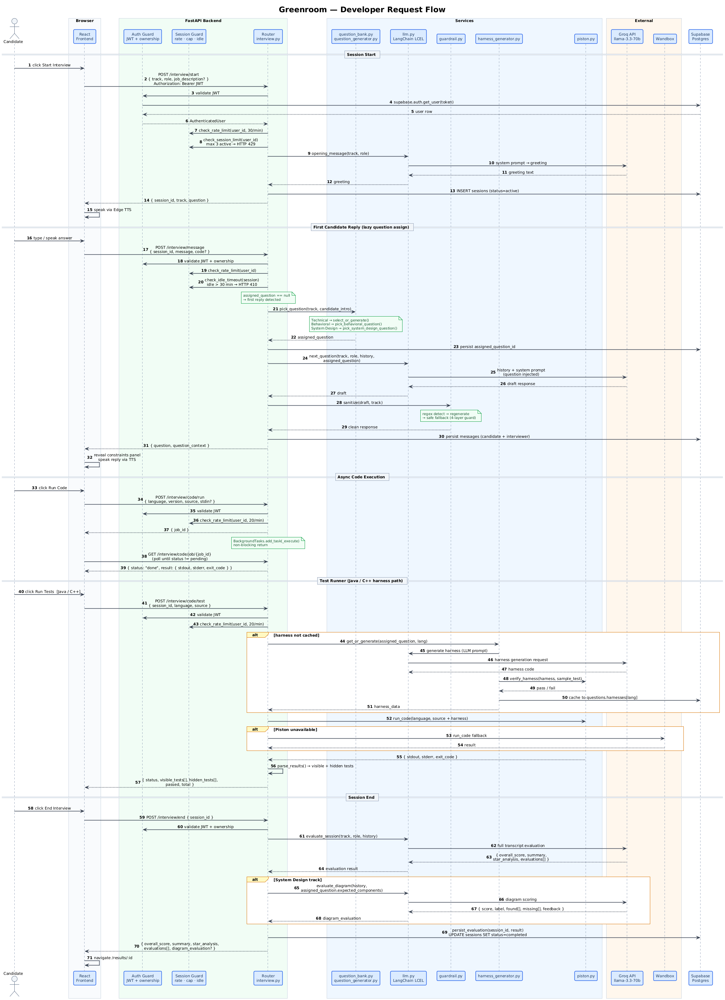

# Greenroom: Technical Design Document

**Authors:** Vishwajeet, Geet, Anurag, Nithin, Mahati, Yuang
**Version:** 6.0 · August 2026
**Status:** Active
**Live app:** https://greenroom-frontend.orangeground-05e56063.swedencentral.azurecontainerapps.io

---

## 1. Overview

### 1.1 Problem Statement

Students and early-career candidates have no free, realistic way to practice interviews with structured feedback. Existing options each miss a key dimension:

| Option | Gap |
|---|---|
| Human mock interviews | Hard to schedule, inconsistent scoring, often cost money |
| Static Q&A tools | No adaptive follow-up, no voice, no live coding |
| General AI chatbots | No interview structure, no scoring rubric, no STAR evaluation |

Greenroom fills this gap: an AI-driven interview platform that speaks out loud, runs code live, scores system-design diagrams, and delivers a structured STAR evaluation at zero cost to the candidate.

### 1.2 Goals

| Goal | Measure |
|---|---|
| Realistic AI-driven interview | Candidate completes a full session end-to-end: voice, adaptive follow-ups, scored report |
| STAR-based evaluation | Per-dimension STAR scores and improvement points on every session |
| Three interview tracks | Behavioral (STAR Q&A), Technical (live code execution), System Design (canvas + diagram scoring) |
| Curated question bank | 357 questions across all tracks, each with structured metadata |
| Free infrastructure | Zero recurring cost on Azure for Students credits |

### 1.3 Non-Goals

- Seniority level differentiation (Entry / Senior)
- Role-specific question sets beyond Software Engineer (PM, Data Science, DevOps)
- Evaluation accuracy benchmarking against human raters
- Native mobile clients

---

## 2. Architecture

Greenroom is a three-service web application. The candidate interacts through a browser. The backend handles all intelligence: LLM calls, code execution, evaluation, and session management. Supabase provides authentication and persistent storage.

### 2.1 System Architecture



> **Color guide:** Blue = client-facing core service, Green = Azure backend components, Yellow = guardrail engine / LLM providers (both conversation and evaluation), Orange = external TTS, Red = external code execution (no SLA), Purple = CI/CD
>
> **Updated 2026-08-04** to replace the retired self-hosted Piston sandbox with Judge0 (public → RapidAPI, both external — no more internal-only container), and to show the Guardrail Engine and Evaluation Engine as their own components instead of folded into the LLM Orchestrator, plus Analytics/Telemetry, the Ad-hoc Harness Generator, and TTS's disk cache. Source: `docs/diagrams/architecture.puml` (PlantUML) — regenerate with `plantuml docs/diagrams/architecture.puml`.

### 2.2 User Flow



### 2.3 Developer Request Flow



### 2.4 Request Lifecycle

A complete session moves through the following steps:

1. **Authentication.** The candidate logs in via email/password. Supabase handles PKCE flow and no credentials touch the backend code. The browser receives a JWT.

2. **Session start.** The frontend sends `POST /api/interview/start` with a Bearer JWT. The backend validates the token server-side against Supabase, enforces the session concurrency cap (max 3 active per user), generates an opening greeting via the LLM, and returns `{session_id, question}`.

3. **Interview loop.** On each turn the candidate speaks or types a reply; the frontend sends `POST /api/interview/message`. The backend checks the idle timeout (30 min, 410), assigns a question from the bank on the first reply (lazy assignment), calls the LLM, passes the response through the guardrail filter, and returns the interviewer's next question as text. The frontend speaks the reply via the TTS endpoint.

4. **Technical track.** The candidate writes code in a Monaco editor, pre-populated with real starter code for whichever language they pick. `POST /api/interview/code/test` runs the candidate's code against the assigned problem's test cases synchronously and returns per-case results (visible cases show input/expected/actual; hidden cases show pass/fail only). A candidate can ask the interviewer, in plain language, for a different problem mid-session — this is detected server-side (no UI button), and the editor/boilerplate reset to the new question. This also now works for problems the interviewer invents live in conversation, not just curated bank questions — Java/C++ test cases for ad-hoc problems previously surfaced "not yet supported" (see `adhoc_harness.py` in §3). The candidate's submitted code is persisted as part of the transcript turn itself (previously only their prose message was saved, silently dropping the code from the Results-page transcript).

5. **System Design track.** Each message automatically serialises the Excalidraw canvas into a structured text description appended to the message body, so the AI interviewer can comment on the diagram in real time. The canvas also autosaves independently every 2 seconds via `POST /api/interview/diagram` (for resume-after-refresh); as of this week, that autosaved state is also what session-end diagram scoring reads from directly, rather than only the last chat-embedded description (see step 6).

6. **Session end.** `POST /api/interview/end` sends the full transcript to the LLM for evaluation. For system-design sessions, a second LLM call scores the candidate's diagram against the question's `expected_components` — this now reads the autosaved `diagram_elements` state directly (falling back to the chat-embedded description for compatibility), so a candidate who draws their diagram and ends the session without one more chat message still gets it graded; previously that diagram silently scored 0 as "not submitted" even though it rendered fine on the Results page. The backend persists all scores and returns a structured scorecard.

7. **Resume.** A candidate can leave mid-session and come back — `GET /api/interview/{id}/resume` restores the full message history, the assigned question, and (for system-design) the saved diagram, and counts as activity so resuming never triggers the idle timeout. The system-design canvas itself autosaves via `POST /api/interview/diagram` on a 2-second debounce.

---

## 3. Key Design Decisions

### LangChain LCEL chains

All LLM interactions use LangChain Expression Language rather than plain API calls. LCEL chains inject the full typed conversation history (`AIMessage` / `HumanMessage`) on every request via `MessagesPlaceholder`. `JsonOutputParser` validates LLM output against a Pydantic schema at parse time. Swapping the LLM provider requires changing one line — proven this week: the end-of-session evaluation report (`evaluate_session`, `_self_critique`, `evaluate_diagram`) now runs on **Azure OpenAI (gpt-5-mini)** instead of Groq, via a second `_make_azure_llm()` factory alongside the existing `_make_llm()`. Everything else — the opening greeting, the live interview conversation, question selection, guardrail checks, harness generation — stays on Groq, unchanged. gpt-5-mini is a reasoning-family model: it only accepts the default `temperature` (passing anything else 400s) and silently burns its whole token budget on hidden reasoning unless `reasoning_effort="minimal"` is set, which is why the two factories aren't simply unified into one.

| Dimension | Plain API call | Greenroom (LCEL) |
|---|---|---|
| Conversation memory | Single turn only | Full typed history injected automatically |
| Output validation | None | Pydantic schema enforced at parse time |
| Provider swap | Rewrite every call site | One line: `ChatGroq(...)` to `ChatOpenAI(...)` |
| LLM fallback | None | Auto-retry on Ollama Cloud on 429 / 5xx |

### Lazy question assignment

Questions are assigned on the first candidate message, not when the session starts. This allows the LLM to use the candidate's self-introduction to select the most contextually appropriate question from the bank. The assignment is persisted to Supabase and injected into every subsequent LLM call.

```
POST /interview/start        ->  greeting only; assigned_question = null
POST /interview/message (1)  ->  pick_question(track, intro) -> inject into system prompt
POST /interview/message (2+) ->  question already present in session state
```

**Difficulty weighted by inferred seniority (new this week).** Question selection previously ignored the candidate's stated role entirely, using a flat random choice across easy/medium for every candidate. `infer_seniority()` buckets the free-text `role` string (e.g. "Junior Backend Engineer", "Staff Software Engineer") into `junior` / `mid` / `senior`, and every `pick_*_question()` call now weights its random choice accordingly — junior interviews skew toward easy with few mediums and no hards; senior interviews skew toward medium/hard and rarely open with easy; unlabeled roles fall back to the old uniform-ish behavior. Wired through the bank picker, the behavioral/system-design pickers, and the ad hoc question-generation LLM prompt alike, so a generated (non-bank) problem's difficulty is guided the same way.

### Postgres-backed rate limiter

The rate limiter uses a `rate_limit_events` table in Supabase, with one row per request pruned after five minutes. Every backend replica queries the same Postgres instance, so the limit is truly per-user across the fleet. It falls back to an in-memory deque if the table does not exist, with a try/except guard so a missing migration never crashes the backend.

| Dimension | In-memory | Postgres-backed |
|---|---|---|
| Multi-replica correctness | Silently doubles at 2 replicas | Single shared counter across all replicas |
| Persistence across restart | Lost | Survives restarts |
| Local dev without DB | Only mode | Auto-fallback |

### Session concurrency cap, idle timeout, and turn limit

Three independent session-level guards in `session_guard.py`:

- **Concurrency cap:** `check_session_limit()` counts `sessions WHERE status='active' AND user_id=?`. Returns HTTP 429 if >= 3. Configurable via `MAX_ACTIVE_SESSIONS`.
- **Idle timeout:** `check_idle_timeout()` compares `last_activity_at` against `now()`. Returns HTTP 410 if > 30 minutes idle. Configurable via `SESSION_IDLE_TIMEOUT_MINUTES`.
- **Turn limit:** `is_turn_limit_reached()` counts candidate turns in the session history. Once `MAX_CANDIDATE_TURNS` (default 15) is reached, the interviewer wraps the session up instead of continuing to ask questions, so a session can't run indefinitely.

All three run on every `/message` call after JWT validation, before the LLM call.

### Judge0-based code execution (Piston + Wandbox retired, 2026-08-03)

Both prior execution backends were confirmed dead in production this week: Wandbox's container runtime started failing every request with a persistent OCI `crun: clone: Resource temporarily unavailable` error, and emkc.org's public Piston API (the interim replacement for the self-hosted instance) became whitelist-only and stopped accepting new callers. `services/piston.py` was rewritten around Judge0 instead — the module name is kept for now to minimize churn across call sites, but it no longer talks to Piston at all:

```
POST /api/interview/code/test
  -> Tier 1: Judge0 public instance      (ce.judge0.com, no key, no signup, no SLA)
      if unavailable -> fall through
  -> Tier 2: Judge0 via RapidAPI          (optional key, more reliable second attempt)
      if unavailable -> fall through
  -> Tier 3: Local subprocess              (Python/Node/C++ compiled+run in-container; Java has no fallback)
      if unavailable -> fall through
  -> Tier 4: "Temporarily unavailable" message to candidate
```

Judge0's own status codes distinguish a real compile/runtime result (id 6 = compile error, 11 = runtime error — shown to the candidate as-is) from a judge-side infra failure (id 13 = internal error, or a missing/unparseable status — treated as "unavailable" and retried on the next tier). The backend Dockerfile now installs `g++` so the local-subprocess fallback can actually compile C++, not just run Python/Node. The self-hosted Piston Azure Container App, its internal-only ingress, and the `piston/` directory's Dockerfile/build config are no longer part of the live deployment (see Open Risks for the leftover-config cleanup this implies).

**Ad-hoc Java/C++ test support (new).** Java/C++ test running previously only worked for questions pulled from the curated bank — any problem the interviewer invented live in conversation (not bank-sourced) had zero Java/C++ support and surfaced "Test cases are not yet supported." `services/adhoc_harness.py` reuses the exact generate → sandbox-verify → corrective-retry machinery already built for the curated bank (`harness_generator.py`), just keyed by problem text instead of a bank question id, with an in-memory-only cache since ad-hoc problems have no cross-candidate reuse value worth persisting to Supabase.

### Dynamic test runner: two modes

The test runner handles both problem formats present in the question bank:

- **call/expected** (LeetCode-style): The LLM provides test *data* (JSON), not runnable code. The data is injected into a harness template controlled by the backend.
  ```json
  [{"call": "two_sum([2,7,11,15], 9)", "expected": "[0, 1]"}]
  ```
- **stdin/stdout** (Codeforces-style): The candidate's raw source is the program. Each test case provides `stdin`; stdout is compared against expected output. All languages Judge0 supports are valid with no whitelist.

### Per-language boilerplate: dataset-first, LLM as fallback

Java and C++ require a full compilable harness: imports, main, type-safe assertions. Generating this correctly with an LLM alone had a measured ~40-60% first-try success rate — enough failure that a large share of questions were permanently unusable in those two languages. The current approach sources real, official LeetCode starter code directly from a public problem dataset (`neenza/leetcode-problems`, matched to the bank by title) wherever a match exists, and builds the java/cpp test-driver deterministically (no LLM call) from the bank's own typed test data — parsing the dataset's own method signature, translating each test's arguments into typed literals, and generating the compare/print logic from a fixed template. Every generated boilerplate+driver is compiled in the sandbox before it's ever cached; nothing is served unverified.

Where no dataset match exists, or the deterministic driver can't handle the problem's shape (a custom type, a stateful/constructor-based problem), the backend falls back to the original approach: the LLM generates three sections (boilerplate, reference solution, test harness), the reference solution is run through the sandbox to verify all test cases pass, and the result is cached under `questions.harnesses[language]`. This path also feeds the exact compiler/runtime error from a failed attempt back into the next retry (`_GENERATION_ATTEMPTS = 4`) instead of blindly re-generating from scratch, and permanently caches a negative result (`_UNSUPPORTED_MARKER`) once every attempt is exhausted, so the same known-hard question is never silently re-attempted on every future request. A question whose java/cpp harness remains unsupported after all of this is either served in Python/JS only, or — for a subset that repeatedly failed — swapped for a same-difficulty, same-topic replacement problem from the same dataset, itself only accepted once its solution is sandbox-verified against the problem's own official example output.

Python and JS don't need a harness — the test runner calls the candidate's function directly — but they still get a question-specific signature instead of a blank editor, sourced the same dataset-first way. For LeetCode-style `Solution().method` problems the parameter names are otherwise extracted deterministically from the bank's own test data (so a candidate can never see a keyword-argument name that doesn't match what the test runner will actually call); for plain functions and stateful/constructor-based problems the signature is LLM-generated and syntax-verified as a last resort. Either way, the candidate's editor starts on the same boilerplate every time, and a reset button in `CodeEditor.jsx` restores it if they want to start over.

### Question-bank call-signature integrity (bug found and fixed this week)

The Python and Node/JS test harnesses (`test_runner.py`) execute each test case's stored `call` string verbatim via `eval`/`exec` — e.g. `Solution().isPowerOfFour(n = 16)` for a class-based (LeetCode-style) problem. An audit of the live `questions` table found **137 of 210 class-based technical questions** had `tests[].call` strings missing the `Solution().` prefix implied by their own `function_name` (e.g. bare `isPowerOfFour(n = 16)` instead of `Solution().isPowerOfFour(n = 16)`) — every submission, including perfectly correct code, threw `NameError`/`ReferenceError` and failed all tests. This was corroborated by production telemetry: the technical track's average score (2.4/10) was far below behavioral (5.0) and system-design (4.0), with 8 of 14 completed sessions scoring 0-2. All 137 rows were patched in place (`tests[].call` now consistently prefixed); verified zero remaining mismatches.

Fixing that surfaced a second, independent, pre-existing bug: JavaScript throws `Class constructor X cannot be invoked without 'new'` on a bare `Solution()` call, which is valid Python but not valid JS. `_node_harness` now runs a targeted transform (`_add_js_new_keywords`) that inserts `new` before any capitalized identifier in a fresh-instantiation position (start of the call, or right after `=`/`;`) without touching method calls — verified live against Judge0 for both languages on the previously-broken question. Java/C++ were unaffected by either bug: their harnesses are LLM-generated from `function_name` and sandbox-verified before ever being cached, never executing the raw `tests[].call` string.

### Four-layer guardrail against answer leaks

The AI interviewer must never reveal the answer or optimal complexity. Four independent layers enforce this:

1. **Prompt hardening:** Track personas explicitly forbid stating time/space complexity or recommending specific algorithms.
2. **Regex detection:** Patterns catch common leak signals the model still produces (e.g. "O(n)", "time complexity is", "you should use a hashmap").
3. **Regeneration:** On detection, the response is regenerated with a corrective instruction: "your previous draft leaked the answer, rewrite it so it only asks a question."
4. **Safe fallback:** If the regenerated response still leaks, a pre-written safe question replaces it entirely.

### JWT + RLS: three ownership verification layers

Every request passes through three independent ownership verifications:

1. `auth.py` validates the JWT via `supabase.auth.get_user(token)`, always server-side, never decoded locally.
2. `check_ownership()` in `session_guard.py` compares `session.user_id` against the authenticated user's ID.
3. Postgres RLS policies enforce the same ownership rule independently at the database level.

Even if application code contained a bug, the database would not return another user's rows.

### Two-key architecture

The frontend holds only the Supabase **anon key** (safe to expose, used for PKCE login). The backend holds the **service-role key** (secret, injected via environment variable at deploy time, never sent to the browser). The service-role key bypasses RLS so the backend can write on behalf of any user, but it is never exposed outside the server process.

### Diagram evaluation: system-design track

When a system-design session ends, `llm.evaluate_diagram()` scores the candidate's Excalidraw canvas against the `expected_components` list on the assigned question. The LLM returns structured JSON: components found, components missing, proximity score (0-10), label, and one-sentence feedback. The Results page renders this as a dedicated Architecture Diagram card with a colour-coded component checklist.

**Fixed this week:** `evaluate_diagram()` previously only extracted a diagram description from `[Architecture diagram]` blocks embedded in past chat messages (via the frontend's `generateBoardDescription()`, called only from the send-message handler) — it never looked at the autosaved `session["diagram_elements"]` state from `POST /api/interview/diagram`. A candidate who drew their diagram, reviewed it, and clicked "End session" without one more chat message — a completely natural flow — got `proximity_score: 0` and "no architecture diagram was submitted," even though their diagram was saved and rendered correctly on the Results page. `_describe_diagram_elements()` (a Python port of the frontend's `generateBoardDescription()`) now builds the same structured description directly from `diagram_elements` and is preferred over the chat-history extraction, which remains as a fallback.

### TTS response caching

`GET /api/tts/speak` previously regenerated audio via `edge-tts` from scratch on every call, even for text already synthesized moments earlier — a candidate replaying the interviewer's question, or navigating back to one already asked, paid the full latency and (conceptually) cost again. `services/tts.py` now caches on disk, keyed by `sha256(voice:text)`, with atomic writes (temp file + rename) and LRU eviction once the cache exceeds a bounded entry count.

### Self-critique pass on the evaluation chain

`evaluate_session()` runs a second LLM pass after the draft score and feedback are generated: a reviewer persona checks the draft against the transcript and corrects it where the score doesn't match the written feedback, the feedback reads as generic filler, or the transcript has evidence the first pass missed. If the draft already holds up, the reviewer is instructed to leave it unchanged rather than edit for its own sake. The pass is best-effort — any failure (bad JSON, LLM error) just falls back to the original draft, so it can never turn a working evaluation into a broken one, and it's controlled by `EVAL_SELF_CRITIQUE_ENABLED` so it can be switched off without a code change if it adds latency or cost that isn't worth it.

### Content-addressed response cache for repeated LLM calls

The durable, expensive artefacts — generated harnesses, signatures, and questions — were already cached in Supabase. What wasn't cached was the per-interaction traffic that repeats *within* a single coding interview.

The dominant case: the dynamic test runner's LLM case generator (`test_runner._generate_cases`) fired on **every** "Run tests" click for a problem the interviewer invented on its own. A candidate clicks Run tests 5-20 times against one problem in a session, and each click re-sent the full problem statement and re-generated the same six cases at temperature 0.1 — the same request, billed every time. `services/llm_cache.py` keys the response on a SHA-256 of the prompt inputs, so those N calls collapse to 1.

The opening greeting (`llm.opening_message`) is the second case: its only inputs are `(track, role)`, a handful of distinct values across the whole product, yet it was generated fresh at every session start. Collapsing it to one cached string would make every candidate hear the identical sentence forever, so it uses a **variant pool** instead — the first `LLM_OPENING_POOL_SIZE` sessions per `(track, role)` generate and fill the pool, and every session after that is served free from it at random, preserving the variety the temperature-0.9 call was there to provide.

The cache is in-process and bounded (LRU + TTL), deliberately matching the durability characteristics of `session_store` rather than introducing new infrastructure — it resets on restart and is per-replica, which is acceptable because a cache miss is only ever a cost, never a correctness problem. A falsy result (failed generation, unparseable JSON) is **not** cached: that's transient, and the next click should get a real attempt rather than a pinned failure for the whole TTL. Durable negative results stay where they belong, in `harness_generator._UNSUPPORTED_MARKER`.

Each entry records the prompt and response sizes it stands in for, so `GET /api/analytics/llm-cache` reports a measured saving rather than an estimate — those counters are the input to the model cost comparison.

---

## 4. Scope

### Implemented

- **Behavioral track:** multi-turn STAR-format Q&A with TTS voice; question assigned from the bank on first reply via `pick_behavioral_question()`, difficulty weighted by inferred candidate seniority
- **Technical track:** Monaco editor with a tabbed Description/Examples/Constraints panel, synchronous code execution (Python, JS, Java, C++) via Judge0 (public → RapidAPI → local subprocess), dynamic test runner (call/expected + stdin/stdout), question-specific starter code for every language (real official starter code sourced from a public LeetCode dataset wherever matched, LLM-generated and sandbox-verified as fallback) with a reset-to-original button, candidate-requested question switching mid-session (detected server-side from plain conversational language, no button), all languages supported for stdio problems, ad-hoc (interviewer-invented) problems now also get Java/C++ test support, difficulty weighted by inferred seniority, submitted code persisted in the saved transcript (not just prose)
- **System Design track:** Excalidraw canvas with real-time serialisation; diagram scoring at session end against `expected_components`, now scored from the autosaved board state directly rather than only a chat-embedded description
- **Session management:** concurrency cap (max 3, HTTP 429), idle timeout (30 min, HTTP 410), per-session candidate turn limit (15, then the interviewer wraps up), session history and delete, full session resume (message history, assigned question, and system-design diagram restored), paginated session listing via `GET /api/interview/sessions` (Dashboard now reads through the API instead of querying Supabase directly from the frontend — the only place in the app that previously bypassed the API layer for reads)
- **Question bank:** 357 questions total, all served from Supabase across all three tracks:
  - 295 technical: LeetCodeDataset (Kaggle / newfacade, MIT) + CodeContests (DeepMind, CC-BY-4.0) + `neenza/leetcode-problems` (boilerplate source) + 8 hand-written; all constraints and examples filled
  - 42 behavioral: `ashishps1/awesome-behavioral-interviews`; each with `expected_elements` (STAR components)
  - 20 system-design: `donnemartin/system-design-primer`; each with `expected_components` for diagram scoring
- **LLM pipeline:** Groq (Llama 3.3 70B) primary with Ollama Cloud fallback for the live interview (greeting, conversation, question selection); Azure OpenAI (gpt-5-mini) for the end-of-session evaluation report and self-critique pass; LangChain LCEL chains throughout; four-layer guardrail
- **Code execution:** Judge0 public instance (primary) → Judge0 via RapidAPI (secondary) → local in-container subprocess (Python/Node/C++ last resort) — self-hosted Piston and Wandbox both retired this week after being confirmed dead in production; ad-hoc Java/C++ test support for interviewer-invented problems
- **Auth:** Supabase email/password + PKCE OAuth; JWT validated server-side on every request; Postgres RLS
- **Rate limiter:** Postgres sliding-window (30 req/min standard, 20 req/min code); in-memory fallback; TTS gated behind the same auth + rate limit as every other endpoint; analytics event/stats endpoints rate-limited and payload-size-bound (previously the only unguarded routes)
- **Response caching:** TTS audio cached on disk by `sha256(voice:text)` with LRU eviction — no more full re-synthesis for repeated/replayed questions
- **Navigation labels:** the interview-list page is now labeled "Your Interviews" (was "Dashboard"), and the stats page is now labeled "Dashboard" (was "Telemetry") — routes (`/dashboard`, `/telemetry`) are unchanged, only nav text and page headings moved
- **Observability:** structured JSON logging via `structlog`; usage/click analytics (`analytics_events`); GitHub Actions CI/CD (lint, type-check, pytest, Vitest)

### Known infrastructure constraints

- **Code execution now depends on a third-party public service (Judge0):** since the self-hosted Piston sandbox was retired (see §3), execution reliability is bounded by `ce.judge0.com`'s uptime/SLA (none guaranteed) and, secondarily, RapidAPI's Judge0 quota if a key is configured. The Azure-privileged-mode limitation that motivated self-hosting Piston in the first place (`--privileged` Docker blocked on the free consumption plan) is now moot, since nothing self-hosted needs it — but it trades a controlled-uptime internal dependency for an external one. See Open Risks.
- **Supabase free tier:** 500 MB storage, 2 connections/second ceiling.
- **Web Speech API:** browser speech recognition only works in Chrome and Edge, and requires HTTPS in production.

---

## 5. Security

**Controls in place:**

- Every request validated server-side via `supabase.auth.get_user(token)`; JWT never decoded locally — including the TTS endpoint, which now requires the same bearer token and rate limit as every other route
- Session ownership checked in application code (`check_ownership`) and independently enforced by Postgres RLS policies
- All inputs validated by Pydantic before any business logic runs: 100 KB max source code, 20 KB max message, 2,000 chars max TTS text, 50 chars max language/version strings
- No SQL injection surface; all database queries use the Supabase SDK's parameterized methods
- Secrets only in environment variables, confirmed by code grep and CI fitness function; nothing hardcoded
- CORS locked to the deployed frontend origin via `ALLOWED_ORIGINS`
- Four-layer guardrail prevents the LLM from leaking problem answers or optimal solutions
- `analytics_events.session_id` and `rate_limit_events.user_id` now have real foreign keys back to their parent rows (previously orphaned on session delete, unlike every other user/session-owned table)
- `dompurify` pinned via a package override to a patched version, closing a known XSS advisory in the transitive dependency chain
- CI/CD uses OIDC federated identity; no Azure credentials stored as repository secrets
- Architecture fitness function in CI checks: frontend never imports `SERVICE_ROLE_KEY`; every session endpoint calls `check_ownership`

**Known gap: reliance on an external, no-SLA sandbox provider**

Code execution now runs entirely on Judge0 (public instance, optionally RapidAPI), neither self-hosted nor internal-only, replacing the earlier Piston isolation-gap concern with a different tradeoff: submitted candidate code executes on infrastructure Greenroom doesn't control or isolate itself. The local-subprocess last-resort fallback is weaker still — it runs directly in the backend's own container, not a separate sandbox, for Python/Node/C++ (Java has no fallback tier at all). Mitigated today by trusting Judge0's own isolation and treating the local-subprocess tier as a rare, best-effort last resort rather than a steady-state path. A production fix would self-host Judge0 (or gVisor/nsjail-backed Piston) behind Azure's internal-only ingress once budget allows a dedicated workload profile.

---

## 6. Testing and Observability

### Testing

| Layer | Coverage |
|---|---|
| `pytest` unit tests | Guardrail logic, Pydantic model validation, rate limiter behaviour, session ownership/concurrency-cap/idle-timeout/turn-limit (`session_guard.py`, 15 tests), the full Supabase write path (`persistence.py`, 12 tests), Judge0 execution chain and status-code classification (`piston.py`), ad-hoc Java/C++ harness generation (`adhoc_harness.py`), dynamic test-runner call/expected + stdin/stdout modes |
| Router-level tests | `interview.py` (session start/message/resume/diagram/code-test/delete/end) — previously only its dependencies were tested in isolation, never the router itself; mounts just the interview router (not the full app, which loads real Supabase creds from `.env` at import time) |
| Architecture fitness functions | Frontend never imports `SERVICE_ROLE_KEY`; `supabaseClient` does not reference service-role credentials |
| `Vitest` frontend tests | API module surface contracts; security boundary check; **first-ever hook test suite this week** — 22 tests across `useCodeRunner` (starter code defaults, boilerplate fetch on language switch) and `useInterviewSession` (session lifecycle, diagram warning, turn-limit/429/410 handling) |
| CI gate | Lint (ruff), type-check, pytest, Vitest; Docker build blocked until all pass |

Planned additions: `httpx.AsyncClient` integration tests covering endpoint ownership checks, rate limiter boundaries, and Pydantic validation edge cases; expanded Vitest coverage for remaining hooks and page components.

### Observability

Structured JSON logging via `structlog` per LLM call and per HTTP request (method, path, status, latency), capturing track and provider (groq/fallback). An in-app telemetry dashboard (`GET /api/analytics/stats`, `frontend/src/pages/Telemetry.jsx`) surfaces total/completed sessions, average score overall and per track, per-track completion rate, a 14-day session-activity chart, code-run language usage, and score distribution — built directly from the `sessions`/`analytics_events` tables, no external service required.

Planned additions:

- Sentry free tier for error tracking
- Azure Log Analytics: Judge0-tier split (public / RapidAPI / local subprocess), guardrail trigger rate, p95 latency on `/interview/message` and `/interview/code/test` (drafted in `infra/monitoring.bicep`, not yet deployed — the metric name still says "Piston vs Wandbox" and needs updating to the current Judge0 tiers before this is applied)

**Privacy:** Candidates can delete all session data at any time via `DELETE /api/interview/{id}`. Source code is sent to Judge0 (an external public service) for execution, and to the backend's own container as a last-resort local fallback; this is disclosed. No PII is logged.

---

## 7. Deployment

### Service URLs

```
Frontend   https://greenroom-frontend.orangeground-05e56063.swedencentral.azurecontainerapps.io
API        https://greenroom-api.orangeground-05e56063.swedencentral.azurecontainerapps.io
Judge0     https://ce.judge0.com  (public, external — replaces the retired self-hosted Piston)
```

### CI/CD Pipeline

Every push to `main` that touches `backend/` or `piston/` triggers `.github/workflows/deploy-containers.yml` (the `piston/**` path filter is now leftover from before this week's migration — the directory still exists in-repo but no longer builds/deploys anything live; see Open Risks):

1. CI gate: lint (ruff), type-check, pytest, Vitest
2. Docker Buildx builds images targeting `linux/amd64`
3. Images pushed to GitHub Container Registry (`ghcr.io`) tagged with commit SHA and `latest`
4. Azure authentication via OIDC federated identity; no credentials stored in GitHub
5. Container Apps updated via `az containerapp update` pointing to the new image tag

The frontend is deployed separately via its own workflow.

### Container Resources

| Container | CPU | Memory | Min replicas | Max replicas |
|---|---|---|---|---|
| Backend API | 0.5 vCPU | 1.0 Gi | 0 | 2 |

The Piston Container App (previously listed here) was decommissioned this week — code execution is now handled entirely by the external Judge0 service (see §3), so there is no longer a second container in the deployment.

### Rollback

```bash
az containerapp update \
  --name greenroom-api \
  --resource-group <rg> \
  --image ghcr.io/vishwajeetraut/greenroom-api:<previous-sha>
```

### Environment Variables

**Backend:**
```
GROQ_API_KEY=                          # https://console.groq.com/keys
GROQ_MODEL=llama-3.3-70b-versatile
SUPABASE_URL=https://...
SUPABASE_SERVICE_ROLE_KEY=...          # Server-only, never expose to frontend
FALLBACK_BASE_URL=https://api.ollama.ai/v1   # Optional, Ollama Cloud
FALLBACK_API_KEY=...                   # Optional
FALLBACK_MODEL=llama3.3:70b            # Optional
ALLOWED_ORIGINS=https://greenroom-frontend...azurecontainerapps.io
MAX_ACTIVE_SESSIONS=3                  # Default: 3
SESSION_IDLE_TIMEOUT_MINUTES=30        # Default: 30
MAX_CANDIDATE_TURNS=15                 # Default: 15
EVAL_SELF_CRITIQUE_ENABLED=true        # Default: true

# Azure OpenAI — end-of-session evaluation report only (evaluate_session,
# _self_critique, evaluate_diagram). Live interview conversation stays on Groq.
AZURE_OPENAI_API_KEY=                  # https://portal.azure.com -> your OpenAI resource -> Keys
AZURE_OPENAI_ENDPOINT=https://your-resource.openai.azure.com/
AZURE_OPENAI_DEPLOYMENT=gpt-5-mini     # Default shown
AZURE_OPENAI_API_VERSION=2024-12-01-preview  # Default shown

# Code execution (backend/services/piston.py) — Judge0, not self-hosted Piston.
# Public Judge0 needs no key and is tried first; RapidAPI key is optional but
# recommended as a more reliable second attempt. If both are unavailable,
# Python/Node/C++ fall back to running directly in this container; Java has
# no fallback tier.
JUDGE0_PUBLIC_URL=https://ce.judge0.com          # Default shown
JUDGE0_RAPIDAPI_URL=https://judge0-ce.p.rapidapi.com  # Default shown
JUDGE0_RAPIDAPI_KEY=                             # Optional — https://rapidapi.com/judge0-official/api/judge0-ce
JUDGE0_RAPIDAPI_HOST=judge0-ce.p.rapidapi.com    # Default shown
LLM_CACHE_ENABLED=true                 # Default: true
LLM_CACHE_TTL_SECONDS=86400            # Default: 86400 (24h)
LLM_CACHE_MAX_ENTRIES=512              # Default: 512
LLM_OPENING_POOL_SIZE=5                # Default: 5
LLM_METER_ENABLED=true                 # Default: true (token accounting)
```

**Frontend:**
```
VITE_SUPABASE_URL=https://...
VITE_SUPABASE_ANON_KEY=...             # Public key, safe to expose
VITE_API_URL=/api
```

---

## 8. Open Risks

| Risk | Mitigation |
|---|---|
| Judge0 public instance has no uptime SLA and can rate-limit under bursty use (observed directly this week during testing) | RapidAPI Judge0 as a second attempt if a key is configured; local in-container subprocess as a last resort for Python/Node/C++ (not Java) |
| Groq rate-limited during peak usage | Ollama Cloud fallback implemented and tested |
| LLM returns invalid JSON despite json_mode | `JsonOutputParser` + safe default evaluation object on parse failure |
| Cross-replica session miss | Sticky sessions as interim; Redis as proper resolution |
| Session state lost on backend restart | In-memory `SESSIONS` cache; Redis resolves permanently |
| Some Java/C++ questions remain unsupported despite dataset-first + LLM-fallback generation | 28 (java) / 31 (cpp) of 218 non-stdio questions, mostly custom-type/graph problems outside the deterministic driver's scope — served in Python/JS only, or swapped for a verified equivalent problem where possible; PR #39 fixed 3 specific known-failing generations (broken quote-escaping, int overflow, markdown-fence parsing) this week — re-checked live against the current `questions` table, the unsupported count is holding steady rather than growing |
| Web Speech API incompatible on Safari / Firefox | Documented requirement: Chrome or Edge + HTTPS |
| Supabase free tier connection ceiling | Batching or upgraded plan |
| Question bank licensing | Only public datasets with explicit licences; no scraping |
| **New:** leftover self-hosted-Piston config still in-repo (`piston/` directory, its Dockerfile/fly.toml, the `piston/**` CI path filter) after this week's Judge0 migration | Not yet cleaned up — dead but harmless; correct next step is to delete once nobody needs to reference the old self-hosted setup, and drop the CI path filter |
| **New:** 137 of 210 class-based technical questions had a live data bug (`tests[].call` missing the `Solution().` prefix implied by `function_name`) making every Python/JS submission fail regardless of correctness, corroborated by technical track's telemetry average (2.4/10, far below the other two tracks) | **Fixed this week** — all 137 rows patched in the live `questions` table; a related JS-only bug (missing `new` keyword for class instantiation) fixed in `test_runner.py`; both verified live against Judge0 for the previously-broken question |
| **New:** system-design diagrams drawn after the last chat message were silently scored 0 ("not submitted") even though saved and rendered correctly | **Fixed this week** — `evaluate_diagram()` now reads the autosaved `diagram_elements` state directly; verified live end-to-end |

---

## 9. References

| Resource | Link |
|---|---|
| GitHub | https://github.com/VishwajeetRaut/greenroom |
| LangChain LCEL | https://python.langchain.com/docs/expression_language |
| Judge0 (code execution, current) | https://judge0.com |
| Judge0 via RapidAPI | https://rapidapi.com/judge0-official/api/judge0-ce |
| Piston (self-host, retired 2026-08-03) | https://github.com/engineer-man/piston |
| Excalidraw | https://github.com/excalidraw/excalidraw |
| Groq | https://console.groq.com |
| Ollama Cloud | https://ollama.com |
| Supabase | https://supabase.com |
| Azure for Students | https://azure.microsoft.com/en-us/free/students |
| awesome-behavioral-interviews | https://github.com/ashishps1/awesome-behavioral-interviews |
| system-design-primer | https://github.com/donnemartin/system-design-primer |
| LeetCodeDataset (Kaggle) | https://www.kaggle.com/datasets/newfacade/leetcode-dataset |
| LeetCodeDataset (arXiv) | https://arxiv.org/abs/2504.14655 |
| neenza/leetcode-problems (boilerplate source) | https://github.com/neenza/leetcode-problems |

---

## Appendix A: Code Structure

```
backend/
  main.py                    # FastAPI app, CORS middleware, router registration, structured logging
  auth.py                    # JWT extraction via Supabase, returns AuthenticatedUser
  models.py                  # Pydantic request/response schemas with field constraints
  routers/
    interview.py             # All interview endpoints: start, message, code/test, boilerplate, resume, diagram autosave, end, delete, sessions (paginated list)
    tts.py                   # TTS endpoint, auth-gated and rate-limited like every other route
    analytics.py             # Rate-limited, payload-bound usage/click event ingestion + GET /stats for the dashboard
  services/
    llm.py                   # LangChain LCEL chains: opening_message/next_question on Groq; evaluate_session (+ self-critique pass) and evaluate_diagram (now reads autosaved diagram_elements directly) on Azure OpenAI gpt-5-mini
    piston.py                # run_code(): Judge0 public -> Judge0 RapidAPI -> local subprocess -> unavailable (module name kept from the retired Piston era; no longer talks to Piston)
    adhoc_harness.py         # Java/C++ test support for interviewer-invented (non-bank) problems — reuses harness_generator's machinery, keyed by problem text, in-memory cache only
    rate_limit.py            # Sliding-window per-user rate limiter: Postgres primary, in-memory fallback
    session_store.py         # In-memory SESSIONS dict with asyncio lock and idle eviction
    session_guard.py         # check_ownership, check_session_limit (max 3), check_idle_timeout (30 min), is_turn_limit_reached (15 candidate turns)
    persistence.py           # Supabase writes: session start, messages, assigned_question, evaluation, diagram, analytics events
    question_bank.py         # 357 questions: Supabase-first load with local JSON seed fallback; infer_seniority() + weighted difficulty picks
    question_generator.py    # LLM selects existing or generates new problem with dual-solution verification, difficulty guided by inferred seniority
    test_runner.py           # call/expected and stdin/stdout test modes, harness injection; _add_js_new_keywords() fixes JS class-instantiation syntax
    harness_generator.py     # Java/C++ harness + Python/JS signature generation: dataset-first (deterministic driver, no LLM), LLM+sandbox-verify as fallback, negative-cached once exhausted
    guardrail.py             # 4-layer answer-leak prevention: prompt + regex + regeneration + fallback
    llm_cache.py             # Content-addressed TTL+LRU cache for repeated LLM calls (test-case generation, opening greeting) with measured token-saving counters
    token_meter.py           # Provider-reported token accounting per call site, attached as a LangChain callback in _make_llm; feeds the model cost matrix
    supabase_client.py       # Singleton Supabase client using service-role key
    logger.py                # structlog JSON logger
    retry.py                 # Exponential-backoff retry decorator
    tts.py                   # edge-tts wrapper -> audio/mpeg stream, now with an on-disk cache keyed by sha256(voice:text)
  data/
    question_bank.json       # 357 questions: 295 technical + 42 behavioral + 20 system-design (local seed)
  tests/
    unit/                    # pytest: guardrail, models, rate_limit, harness_generator, question_bank, llm self-critique, analytics, session_guard, persistence, piston, adhoc_harness, test_runner, interview router
    architecture/            # Fitness functions: security boundaries, API surface contracts

piston/                      # Leftover self-hosted-Piston config (Dockerfile, fly.toml) from before this week's Judge0 migration — no longer built/deployed; not yet removed, see Open Risks

frontend/src/
  pages/
    Landing.jsx              # Public homepage: pitch, how it works, 3-track overview
    Login.jsx                # Email/password login
    Signup.jsx               # Email/password signup with confirm password + show/hide toggle
    AuthCallback.jsx         # Supabase PKCE OAuth redirect handler
    Dashboard.jsx            # Track selector, session history with score/status/delete, JD upload — labeled "Your Interviews" in nav (was "Dashboard"); reads via GET /api/interview/sessions instead of querying Supabase directly
    Interview.jsx            # Live interview: chat pane, Monaco editor, Excalidraw canvas, TTS
    Results.jsx              # Scorecard: overall score, STAR breakdown, category scores, diagram card, transcript (now renders submitted code as a fenced block), Losgann mascot, print button
    Telemetry.jsx             # Stats dashboard — labeled "Dashboard" in nav (was "Telemetry"); route unchanged (/telemetry)
  components/
    CodeEditor.jsx           # Monaco editor with language selector, constraints panel, boilerplate fetch, reset-to-boilerplate button
    TestResultsPanel.jsx     # Visible tests (input/expected/got), hidden tests (pass/fail dots)
    SystemDesignBoard.jsx    # Excalidraw canvas with Live badge, tips bar, diagram serialisation
    Losgann.jsx              # Results-page mascot that surfaces missing STAR elements
    AuthForm.jsx             # Shared login/signup form
    Navbar.jsx               # Top navigation
    Waveform.jsx             # Animated waveform for speech recognition indicator
  hooks/
    useInterviewSession.js   # Session init/send/end lifecycle, diagram warning, turn-limit + 429/410 error handling, analytics events
    useCodeRunner.js         # Language state, per-language boilerplate fetch + reset-to-original, async test runner
    useSpeechRecognition.js  # Web Speech API wrapper
    useSpeechSynthesis.js    # TTS playback hook, attaches Bearer JWT to the audio request
  lib/
    api.ts                   # Typed REST client: attaches Bearer JWT to every request, fire-and-forget analytics tracking
    supabaseClient.ts        # Supabase auth client using anon key, PKCE flow
```

---

## Appendix B: Data Model

```sql
sessions (
  id                   UUID PRIMARY KEY DEFAULT gen_random_uuid(),
  user_id              UUID NOT NULL REFERENCES auth.users ON DELETE CASCADE,
  track                TEXT NOT NULL CHECK (track IN ('behavioral','technical','system-design')),
  role                 TEXT,
  status               TEXT DEFAULT 'active' CHECK (status IN ('active','completed','abandoned')),
  overall_score        INT CHECK (overall_score BETWEEN 0 AND 10),
  summary              TEXT,
  star_analysis        JSONB,   -- {situation, task, action, result, star_score, missing_elements[]}
  diagram_evaluation   JSONB,   -- {components_found[], components_missing[], proximity_score, proximity_label, feedback}
  diagram_elements     JSONB,   -- raw Excalidraw scene, autosaved every 2s for resume
  assigned_question_id TEXT REFERENCES questions(id),
  created_at           TIMESTAMPTZ DEFAULT now(),
  ended_at             TIMESTAMPTZ,
  updated_at           TIMESTAMPTZ
)
-- Indexes: idx_sessions_user_id, idx_sessions_user_created
-- RLS: users see only their own rows

messages (
  id          BIGINT GENERATED ALWAYS AS IDENTITY PRIMARY KEY,
  session_id  UUID NOT NULL REFERENCES sessions ON DELETE CASCADE,
  role        TEXT NOT NULL CHECK (role IN ('interviewer','candidate')),
  content     TEXT NOT NULL,
  sequence_no INT,
  created_at  TIMESTAMPTZ DEFAULT now()
)
-- Index: idx_messages_session_id
-- RLS: users see only messages from their own sessions

evaluations (
  id          BIGINT GENERATED ALWAYS AS IDENTITY PRIMARY KEY,
  session_id  UUID NOT NULL REFERENCES sessions ON DELETE CASCADE,
  category    TEXT,   -- "Clarity" | "Structure" | "Confidence" | "Technical Depth"
  score       INT CHECK (score BETWEEN 0 AND 10),
  feedback    TEXT,
  created_at  TIMESTAMPTZ DEFAULT now()
)
-- Index: idx_evaluations_session_id
-- RLS: users see only evaluations from their own sessions

questions (
  id                   TEXT PRIMARY KEY,
  track                TEXT,           -- technical | behavioral | system-design
  topic                TEXT,
  difficulty           TEXT,           -- easy | medium | hard
  title                TEXT,
  prompt               TEXT,
  function_name        TEXT,           -- method name for call/expected problems
  languages            TEXT[] DEFAULT '{python}',
  tests                JSONB,          -- [{call, expected}] or [{stdin, stdout}]
  constraints          JSONB,
  examples             JSONB,
  harnesses            JSONB,          -- {java: {boilerplate, harness}, cpp: {...}}
  signatures           JSONB,          -- {python: "def two_sum(...): ...", node: "..."}
  expected_elements    JSONB,          -- behavioral: STAR components to surface
  expected_components  JSONB,          -- system-design: architecture components for diagram scoring
  created_at           TIMESTAMPTZ DEFAULT now()
)
-- Index: idx_questions_track
-- RLS: read-only for all authenticated users

rate_limit_events (
  id       BIGSERIAL PRIMARY KEY,
  user_id  UUID NOT NULL REFERENCES auth.users ON DELETE CASCADE,   -- FK added this week (was orphaned)
  ts       TIMESTAMPTZ NOT NULL DEFAULT now()
)
-- Index: idx_rate_limit_events_user_ts ON (user_id, ts)
-- RLS: enabled
-- Rows older than 5 minutes are pruned on each rate-limit check

analytics_events (
  id          BIGSERIAL PRIMARY KEY,
  user_id     UUID NOT NULL,
  session_id  UUID REFERENCES sessions ON DELETE CASCADE,   -- FK added this week (was orphaned; delete_session now has no way to leave these behind)
  event       TEXT NOT NULL,
  properties  JSONB NOT NULL DEFAULT '{}'::jsonb,
  created_at  TIMESTAMPTZ NOT NULL DEFAULT now()
)
-- Indexes: idx_analytics_events_created_at, idx_analytics_events_user_id, idx_analytics_events_event
-- RLS: enabled, no policy for anon/authenticated — service role only
```

---

## Appendix C: API Reference

### Interview: `/api/interview`

| Method | Path | Rate limit | Description |
|---|---|---|---|
| `POST` | `/api/interview/start` | 30/min | Creates session, returns `{session_id, track, question}`. 429 if user has >= 3 active sessions. |
| `POST` | `/api/interview/message` | 30/min | Sends candidate message. Assigns question on first reply (or on a candidate-requested switch). Returns `{question, question_context?, done?}`. `done: true` once the candidate turn limit is reached. 410 if session idle > 30 min. |
| `POST` | `/api/interview/code/test` | 20/min | Runs the candidate's code against the assigned problem's tests synchronously. Returns `{status, visible_tests[], hidden_tests[], passed, total, error_type?}` |
| `GET` | `/api/interview/{id}/boilerplate?language=` | - | Returns `{boilerplate, supported}` for the session's assigned problem in the given language. |
| `GET` | `/api/interview/{id}/resume` | - | Restores an in-progress session: message history, assigned question, and (system-design) saved diagram. Counts as activity. |
| `POST` | `/api/interview/diagram` | - | Autosaves the system-design canvas (`{session_id, elements}`), 2s debounced from the frontend. |
| `POST` | `/api/interview/end` | - | Evaluates session. For system-design: also calls `evaluate_diagram`, now sourced from the autosaved diagram state. Returns `{overall_score, summary, star_analysis, evaluations[], diagram_evaluation?}` |
| `GET` | `/api/interview/sessions?limit=&offset=` | - | Paginated session list for the authenticated user (`limit` 1-200, default 50). Backs the "Your Interviews" dashboard — added this week to stop the frontend querying Supabase directly. |
| `DELETE` | `/api/interview/{id}` | - | Deletes session and all associated messages, evaluations, and analytics events. |

### TTS: `/api/tts`

| Method | Path | Rate limit | Description |
|---|---|---|---|
| `GET` | `/api/tts/speak?text=` | 30/min | Returns `audio/mpeg` stream via Microsoft Edge neural TTS. Text: 1-2,000 characters. |

### Analytics: `/api/analytics`

| Method | Path | Description |
|---|---|---|
| `POST` | `/api/analytics/event` | Fire-and-forget usage/click event. Persists in the background via `BackgroundTasks`; always returns 202 immediately regardless of whether the write succeeds. |
| `GET` | `/api/analytics/stats` | Aggregated telemetry for the in-app dashboard: session counts, average scores overall/per-track, completion rates, 14-day activity, language usage, score distribution. |
| `GET` | `/api/analytics/llm-cache` | LLM response cache counters: hits, misses, hit rate, entries, evictions, and measured prompt/completion tokens saved. Aggregate and in-process only — no prompts, responses, or per-user data; resets on restart. |
| `GET` | `/api/analytics/llm-usage` | Provider-reported token usage broken down by call site, with computed cost. Token counts are exact; dollar figures use indicative pricing (see `token_meter.PRICING`). In-process, resets on restart. |

### Health

| Method | Path | Description |
|---|---|---|
| `GET` | `/api/health` | Returns `{status: "ok"\|"degraded", checks: {supabase, judge0, groq}}` — `degraded` if any dependency check fails; used by Azure health probes. The `piston` check key was renamed to `judge0` this week, following the execution-backend migration. |

All endpoints except `/api/health` require `Authorization: Bearer <JWT>`.

---

## Appendix D: Error Handling Reference

| Scenario | Behaviour |
|---|---|
| Missing or expired JWT | 401; frontend redirects to login |
| Request over rate limit | 429; message shown to candidate |
| 4th concurrent session start | 429; "You have too many active sessions" |
| Session idle > 30 minutes | 410; candidate prompted to start a new session |
| Session belongs to a different user | 403 |
| Groq rate-limited or 5xx | Automatic retry on Ollama Cloud |
| Judge0 public instance unavailable/infra error (status id 13) | Falls through to Judge0 via RapidAPI (if configured) |
| Judge0 RapidAPI also unavailable | Falls through to local in-container subprocess (Python/Node/C++; no fallback for Java) |
| All code-execution tiers unavailable | "Temporarily unavailable" message; session continues without code execution |
| LLM returns invalid JSON | Safe default evaluation object returned; no crash |
| Session ends with no candidate answers | Score 0 with a clear explanation; no LLM call made |
| Java/C++ harness fails verification | Not cached; `error_type: transient` returned; candidate can retry |
| LLM response leaks the answer | Regenerated once with corrective instruction; pre-written fallback if still leaks |
| `rate_limit_events` table missing | Falls back to in-memory rate limiter; no crash |
| Diagram has fewer than 2 connected components | Send blocked; candidate must dismiss warning or improve diagram |
| Diagram drawn but no chat message sent after (e.g. drawn right before "End session") | Fixed this week — `evaluate_diagram` now reads the autosaved board state directly instead of only a chat-embedded description |

---

## Appendix E: Azure Migration Path

Every service has a direct Azure-native equivalent. Moving is a configuration change, not an architectural rewrite.

| Current | Azure equivalent | Change required |
|---|---|---|
| Groq (Llama 3.3 70B) — live interview only | Azure OpenAI via AI Foundry | 1 line in `llm.py`; the evaluation-report half of this migration already shipped this week (`_make_azure_llm`, gpt-5-mini) — only the live-conversation calls (`_make_llm`) remain on Groq |
| Web Speech API (browser STT) | Azure Speech Services real-time STT | Replace browser STT hook |
| edge-tts | Azure Neural TTS | Update `tts.py` |
| Supabase Postgres | Azure Cosmos DB for PostgreSQL | Update connection string |
| In-memory `SESSIONS` dict | Azure Cache for Redis | Update `session_store.py` |
| Judge0 (public API, no longer self-hosted) | Azure Container Apps Dynamic Sessions | Replace `piston.py`'s Judge0 calls — same migration target as before this week's Piston retirement, just starting from a different current state |
| Supabase Auth | Azure Active Directory B2C | Update auth client |
| ACA consumption plan (free) | ACA dedicated D4 workload profile | Enables self-hosting a fully-isolated sandbox again (Piston/gVisor/nsjail) instead of depending on external Judge0 (~$50/month) |

---

## Appendix F: Question Bank Samples

**Technical entry:**
```json
{
  "id": "two-sum",
  "track": "technical",
  "topic": "arrays",
  "difficulty": "easy",
  "title": "Two Sum",
  "prompt": "Given an array of integers `nums` and an integer `target`, return the indices of the two numbers that add up to `target`...",
  "function_name": "two_sum",
  "languages": ["python", "node"],
  "tests": [{ "call": "two_sum([2, 7, 11, 15], 9)", "expected": "[0, 1]" }],
  "constraints": ["2 <= nums.length <= 10^4", "-10^9 <= nums[i] <= 10^9", "Only one valid answer exists"],
  "examples": [{ "input": "two_sum([2, 7, 11, 15], 9)", "output": "[0, 1]", "explanation": "" }],
  "harnesses": null
}
```

**Behavioral entry:**
```json
{
  "id": "beh-conflict-disagreement-001",
  "track": "behavioral",
  "topic": "conflict-resolution",
  "difficulty": "medium",
  "title": "Handling Disagreement",
  "prompt": "Tell me about a time you disagreed with a teammate or manager. How did you handle it?",
  "expected_elements": [
    "situation describing the disagreement context",
    "your task or concern",
    "specific action taken to communicate respectfully",
    "result or resolution achieved"
  ]
}
```

**System-design entry:**
```json
{
  "id": "sd-url-shortener",
  "track": "system-design",
  "topic": "web-services",
  "difficulty": "medium",
  "title": "Design a URL Shortener",
  "prompt": "Design a URL shortening service like bit.ly...",
  "expected_components": ["load balancer", "app server", "database", "cache", "hash function"]
}
```

The first 3 test cases per problem are shown to the candidate as visible (input, expected, their output). Remaining cases run hidden (pass/fail count only). Java and C++ harnesses are generated on first request and stored in the `harnesses` field once verified.

---

*Greenroom v6.0 · August 2026*
