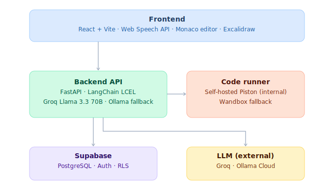

# Greenroom — Dev Design Document

**Team:** Vishwajeet, Geet, Anurag, Nithin, Mahati, Yuang
**Version:** 2.0 · June 2026

---

## 1. Problem Statement & Goals

Students and early-career job seekers have no accessible, realistic way to practice interviews with structured, personalised feedback. Existing options are:

- Human mock interviews: hard to schedule, no consistent scoring
- Static Q&A tools: no adaptive follow-up, no voice, no code execution
- General AI chatbots (ChatGPT, Copilot): no interview structure, no scoring, no STAR evaluation

| Goal | Success Criteria |
|---|---|
| Realistic AI-driven interview | Candidate can complete a full session: speak answers, receive follow-ups, get a scored report |
| STAR-based evaluation | STAR scores, per-dimension feedback, and actionable improvement points per session |
| Three interview tracks | Behavioral, Technical (with live code execution), System Design (with diagram canvas) |
| Multiple seniority levels and roles | Entry Level, Senior, with role-specific question sets (SWE, PM, Data Science, etc.) |
| Prove model accuracy | Evaluation scores benchmarked against human raters and general AI tools |
| Free or student-tier infrastructure | Zero cost for POC; Azure for Students credits for deployment |

---

## 2. Current State (as of June 2026)

The platform has moved beyond local development. The backend and Piston code runner are deployed to Azure Container Apps (Sweden Central). The frontend runs as a Dockerized nginx container on the same environment. CI/CD is fully wired via GitHub Actions.

| Feature | Status |
|---|---|
| Behavioral interview with STAR evaluation | Built + Deployed |
| Technical interview with Monaco code editor | Built + Deployed |
| Sandboxed code execution (self-hosted Piston + Wandbox fallback) | Built + Deployed |
| LangChain LCEL agent (not plain API calls) | Built + Deployed |
| Pydantic-validated structured evaluation output | Built + Deployed |
| STAR analysis panel in results | Built + Deployed |
| LLM primary/fallback (Groq to Ollama Cloud) | Built + Deployed |
| Auth + session history (Supabase) | Built + Deployed |
| Delete session from dashboard | Built + Deployed |
| Dynamic test runner (LLM-generated test cases) | Built + Deployed |
| System Design track with Excalidraw canvas | Built |
| GitHub Actions CI/CD pipeline | Deployed |
| Question bank (LeetCode / InterviewBit sourced) | Planned |
| Seniority levels (Entry / Senior) | Planned |
| Role selector (SWE / PM / Data Science / etc.) | Planned |
| Evaluation accuracy benchmarking vs competitors | Planned |

---

## 3. Architecture



### 3.1 High-Level Stack

| Layer | Service | Notes |
|---|---|---|
| Frontend | React + Vite + Tailwind (Dockerfile + nginx) | Deployed to Azure Container Apps, serves built dist |
| Speech-to-text | Web Speech API (browser) | Chrome/Edge only, no key needed |
| Text-to-speech | edge-tts (backend) | Free, uses Microsoft Edge neural voices |
| LLM (interviewer + scoring) | Groq API (Llama 3.3 70B) with Ollama Cloud fallback | Auto-retry on 429/5xx |
| Code execution (primary) | Self-hosted Piston (Azure Container Apps, internal) | Internal ingress, no public exposure |
| Code execution (fallback) | Wandbox (free public compiler API) | Covers Python, Node, Java, GCC |
| Auth + database | Supabase (PostgreSQL + Row-Level Security) | Free tier |
| CI/CD | GitHub Actions + ghcr.io + Azure OIDC | Deploys on every push to main |

### 3.2 Deployment Topology

All backend services run inside a shared Azure Container Apps environment (`orangeground-05e56063`, Sweden Central). Piston has internal-only ingress — not reachable from the internet. The API is the only external-facing backend service.

```
Frontend  (external)  https://greenroom-frontend.orangeground-05e56063.swedencentral.azurecontainerapps.io
API       (external)  https://greenroom-api.orangeground-05e56063.swedencentral.azurecontainerapps.io
Piston    (internal)  http://greenroom-piston.internal.orangeground-05e56063.swedencentral.azurecontainerapps.io
```

### 3.3 CI/CD Pipeline

Push to `main` triggers `.github/workflows/deploy-containers.yml` which:

- Builds Docker images for the backend and Piston using Docker Buildx (`linux/amd64`)
- Pushes images to GitHub Container Registry (`ghcr.io`) tagged with commit SHA and `latest`
- Authenticates to Azure via OIDC federated identity (no stored passwords)
- Updates the Azure Container Apps via `az containerapp update`, injecting all secrets from GitHub repository secrets

Manual re-deploy is also possible via `deploy.sh`, which builds all three images (including frontend), pushes to `ghcr.io`, and updates all three Container Apps in one command.

---

## 4. How It's Built

### 4.1 LangChain LCEL, not plain API calls

We use LangChain Expression Language chains for all LLM interactions rather than calling `groq.chat.completions.create(...)` directly. Plain API calls are single-turn — you lose conversation history unless you manually rebuild it on every request. LCEL chains use `MessagesPlaceholder` to inject the full typed history (`AIMessage`/`HumanMessage`) exactly as the model expects. `JsonOutputParser(EvaluationResult)` validates LLM output against a Pydantic schema at runtime, so malformed JSON gets caught rather than silently hitting the UI. Swapping the LLM provider is one line — `ChatGroq(...)` becomes `AzureChatOpenAI(...)` and nothing else changes.

| | Plain API call | Greenroom LangChain chain |
|---|---|---|
| Conversation memory | None (single turn) | Full typed history via `MessagesPlaceholder` |
| Role awareness | Manual string concat | Typed `SystemMessage` persona |
| Output validation | None | Pydantic schema enforcement |
| Provider coupling | Groq-specific | Provider-agnostic |
| Fallback | None | Auto-retry on Ollama Cloud (429/5xx) |

### 4.2 Self-hosted Piston with Wandbox fallback

The public Piston API at emkc.org now requires authentication (returns 401). We self-hosted it as an internal Azure Container App and added Wandbox as a second fallback. The execution chain:

```
Candidate clicks "Run code"
    → POST /api/interview/code/run
        → Tier 1: Self-hosted Piston (internal Azure Container App)
            [401 or timeout → fall through]
        → Tier 2: Wandbox (free public compiler, no auth)
            [error → fall through]
        → Tier 3: Graceful "temporarily unavailable" message
```

Wandbox responses get normalised to Piston's response shape before returning, so nothing else in the codebase knows or cares which service handled the execution.

**Note:** Azure Container Apps' free consumption plan doesn't support `--privileged` Docker mode. Piston's `isolate` sandbox needs it. In practice Wandbox handles most cases when Piston's sandbox fails. A dedicated D4 workload profile (~$50/month) would give us full privileged Piston on Azure.

### 4.3 Dynamic test runner

The test runner (`backend/services/test_runner.py`) uses a two-step approach specifically designed to prevent LLM syntax errors from crashing execution. We don't ask the LLM to write runnable code — we only ask it to produce a JSON array of test case data. Then we write the harness ourselves.

**Step 1 — LLM generates test data only:**
```json
[
  {"call": "two_sum([2,7,11,15], 9)", "expected": "[0, 1]"},
  {"call": "two_sum([3,2,4], 6)",     "expected": "[1, 2]"}
]
```

**Step 2 — We inject that data into a harness template we control.** The harness runs 3 visible cases and 3 hidden cases, emits one JSON line per case to stdout, and we parse the results into a structured `RunTestsResponse`.

Currently supports Python and Node.js. Java/C++ return a friendly message. If no coding problem has been assigned in the session yet, the runner returns a clear error rather than generating test cases against an empty history.

### 4.4 Guardrails

| Guardrail | Where | Behaviour |
|---|---|---|
| Piston 401 detection | `services/piston.py` | If self-hosted returns 401, skip to Wandbox without crashing |
| Empty session guard | `routers/interview.py` | If session ends with no candidate answers, returns score 0 with a message instead of sending empty transcript to LLM |
| Test runner no-problem guard | `services/test_runner.py` | Returns friendly error if no coding problem found in history |
| Unsupported language guard | `routers/interview.py` | Friendly message for Java/C++ instead of silent failure |
| CORS lock | `main.py` | `ALLOWED_ORIGINS` env var restricts origins to deployed frontend in production |
| Piston internal-only ingress | Azure Container Apps config | Piston not reachable from the internet; only the API can call it |
| OIDC auth for CI/CD | GitHub Actions workflow | No Azure credentials stored as repository secrets |
| LLM JSON fallback | `services/llm.py` | If JSON parse fails after both Groq and Ollama, returns a safe default evaluation object |

### 4.5 System Design track

Excalidraw (MIT licence, `@excalidraw/excalidraw`) is embedded as the whiteboard. `SystemDesignBoard.jsx` is built and in the frontend. Canvas state serialises to JSON on each answer submission, gets sent to the backend alongside the verbal answer, and the LLM receives a text description of the diagram elements so it can probe the design decisions.

### 4.6 Seniority levels and roles (planned)

The LangChain personas are already parameterised by `track`. Adding `level` (entry/senior) and `role` (SWE, PM, Data Science, DevOps) requires extending the `PERSONAS` dict and adding selectors to the session start flow.

| Parameter | Entry | Senior |
|---|---|---|
| Question difficulty | Easy/Medium | Medium/Hard |
| Follow-up depth | Explain your reasoning | Justify trade-offs, scale, team impact |
| STAR expectation | Situation + Action | Result must include team/business impact |
| Technical depth | Correct solution | Optimal + complexity analysis |

### 4.7 Evaluation benchmarking (planned)

Three-tier benchmark to prove our evaluation is more reliable than asking a general-purpose LLM to score an interview:

- **Tier 1 (human vs model):** 20 real transcripts, 3 human raters, same rubric. Target Pearson r > 0.80.
- **Tier 2 (consistency):** Same transcript run 5 times. Target std dev < 0.5 on a 10-point scale.
- **Tier 3 (competitor comparison):** Same transcript to GPT-4o and Gemini with a plain scoring prompt.

| Metric | Greenroom | ChatGPT (plain prompt) | Gemini (plain prompt) |
|---|---|---|---|
| Human correlation (Pearson r) | TBD | TBD | TBD |
| Score variance (std dev) | TBD | TBD | TBD |
| STAR element coverage | Always (schema-enforced) | Inconsistent | Inconsistent |
| Missing element identification | Structured list | Free text only | Free text only |
| Output structure guaranteed | Pydantic-validated | Unstructured | Unstructured |
| Adaptive follow-up | Based on missing STAR elements | Static | Static |

---

## 5. Risks & Open Questions

| Risk | Likelihood | Impact | Mitigation |
|---|---|---|---|
| Piston privileged mode not supported on ACA free tier | High | Medium | Wandbox fallback handles it; dedicated D4 plan enables full Piston |
| Groq rate-limit during demo | Medium | High | Ollama Cloud fallback already implemented and tested |
| LLM invalid JSON despite json_mode | Low | Medium | `JsonOutputParser` + safe default evaluation object in catch |
| Wandbox down or rate-limited | Low | Medium | Graceful unavailable message; session continues without code execution |
| Question bank sourcing (legal/ToS) | Medium | Medium | Use only public datasets and API wrappers; no scraping |
| Benchmarking human raters sourcing | Medium | Low | Team + mentor can serve as raters for POC |
| Session state lost on backend restart | Medium | Medium | In-memory `SESSIONS` dict; Redis upgrade path documented |

**Open questions:**
1. Should the question bank be seeded manually or pulled live from a LeetCode API wrapper?
2. What roles should be in V1? (SWE confirmed; PM, Data Science, DevOps to confirm with mentor)
3. For system design: save diagram as screenshot (requires vision model) or JSON (current plan)?
4. How many human raters are needed for the benchmark to be statistically defensible?
5. Should session state move to Redis now or only if multi-instance deployment is needed?

---

## 6. Next Steps & Owners

| Action | Owner | Target |
|---|---|---|
| Seed question bank (behavioral + technical) | Dev team | Week 3 |
| Add seniority + role selector to session start | Dev team | Week 2 |
| Parameterise LangChain personas by level | Dev team | Week 2 |
| Integrate System Design track end-to-end (canvas + LLM probe) | Dev team | Week 3 |
| Source 20 transcripts for benchmark | Dev team | Week 4 |
| Recruit 3 human raters for benchmark | Team lead | Week 4 |
| Run benchmark and fill metrics table | Dev team | Week 5 |
| Evaluate Azure OpenAI GPT-4o migration (if credits approved) | Dev team | Week 4 |
| Move session state to Redis if multi-instance needed | Dev team | Week 5 |

---

## 7. Azure Migration Map

Every component has a direct Azure equivalent. Migration requires only configuration changes, no architectural rewrites.

| Current (free) | Azure equivalent | Effort |
|---|---|---|
| ChatGroq (Llama 3.3 70B) | Azure OpenAI GPT-4o via AI Foundry | 1 line in `llm.py` |
| Web Speech API | Azure Speech Services (real-time STT) | Replace browser STT hook |
| edge-tts | Azure Neural TTS (same voices, higher quality) | Update `tts.py` |
| Supabase (PostgreSQL) | Azure Cosmos DB for PostgreSQL | Update connection string |
| In-memory `SESSIONS` dict | Azure Cache for Redis | Update session store module |
| Piston (Docker, internal ACA) | Azure Container Apps Dynamic Sessions | Replace `piston.py` caller |
| Supabase Auth | Azure Active Directory B2C | Update auth client |
| ACA consumption plan | ACA dedicated D4 workload profile | Enables privileged Piston (~$50/month) |

---

## Appendix A: Current Data Model

```sql
sessions (
  id            uuid PRIMARY KEY,
  user_id       uuid -> auth.users,
  track         text,           -- behavioral | technical | system-design
  role          text,           -- e.g. Software Engineer
  level         text,           -- entry | senior  [PLANNED]
  status        text,           -- active | completed
  overall_score int,
  summary       text,
  star_analysis jsonb,          -- STARAnalysis structured object
  created_at    timestamptz,
  ended_at      timestamptz
)

messages (
  id          bigint PRIMARY KEY,
  session_id  uuid -> sessions,
  role        text,             -- interviewer | candidate
  content     text,
  created_at  timestamptz
)

evaluations (
  id          bigint PRIMARY KEY,
  session_id  uuid -> sessions,
  category    text,             -- clarity | structure | confidence | technical depth
  score       int,
  feedback    text
)

questions (                     -- [PLANNED]
  id          uuid PRIMARY KEY,
  track       text,
  difficulty  text,             -- entry | mid | senior
  roles       text[],
  title       text,
  body        text,
  source      text,
  tags        text[],
  test_cases  jsonb
)
```

---

## Links

| Resource | Link |
|---|---|
| GitHub | https://github.com/VishwajeetRaut/greenroom |
| LangChain LCEL docs | https://python.langchain.com/docs/expression_language |
| Piston (self-host) | https://github.com/engineer-man/piston |
| Wandbox | https://wandbox.org |
| Excalidraw | https://github.com/excalidraw/excalidraw |
| Groq | https://console.groq.com |
| Ollama Cloud | https://ollama.com |
| Supabase | https://supabase.com |
| Azure for Students | https://azure.microsoft.com/en-us/free/students |
