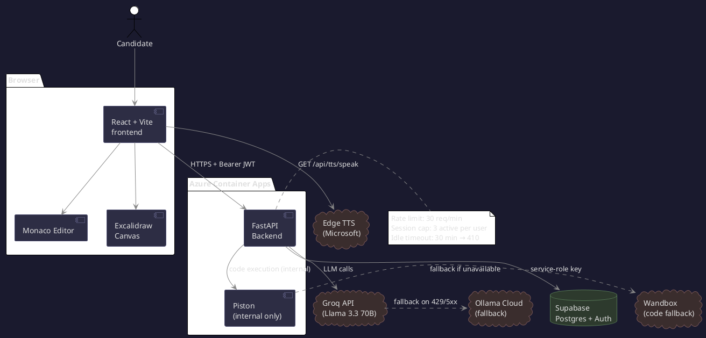
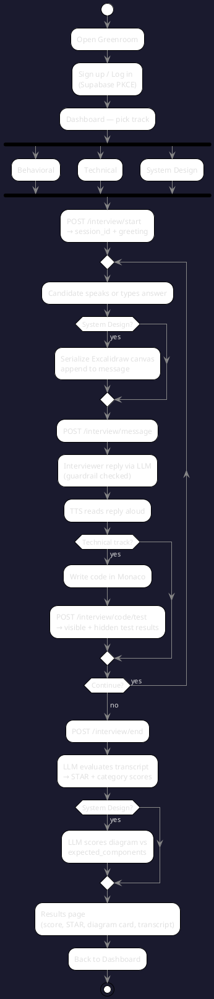
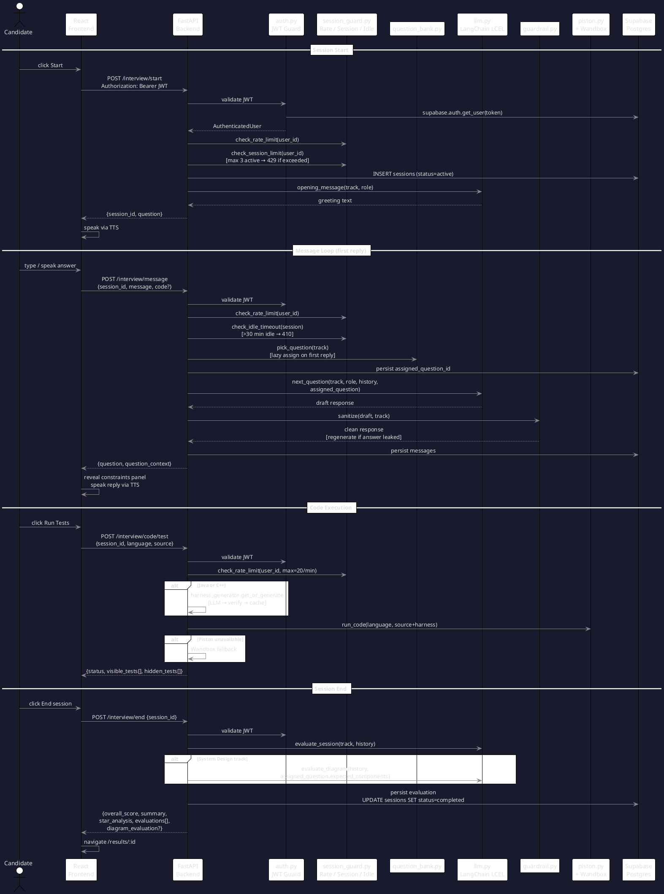

# Greenroom — Dev Design Document

**Team:** Vishwajeet, Geet, Anurag, Nithin, Mahati, Yuang
**Version:** 4.0 · July 2026
**Live app:** https://greenroom-frontend.orangeground-05e56063.swedencentral.azurecontainerapps.io

---

## 1. Dev Design Document

### 1.1 Problem Statement & Goals

Students and early-career candidates have no free, realistic way to practice interviews with structured feedback. Existing options all fall short in different ways:

- **Human mock interviews** — hard to schedule, inconsistent scoring, often cost money
- **Static Q&A tools** — no adaptive follow-up, no voice, no live coding
- **General AI chatbots** — no interview structure, no scoring rubric, no STAR evaluation

Greenroom gives candidates a full interview experience: an AI that asks real questions, adapts to their answers, speaks out loud, runs their code, scores their system-design diagram, and gives a scored evaluation at the end — all for free.

| Goal | How we know we've hit it |
|---|---|
| Realistic AI-driven interview | Candidate completes a full session end-to-end: voice, follow-ups, scored report |
| STAR-based evaluation | STAR scores, per-dimension feedback, and improvement points on every session |
| Three interview tracks | Behavioral, Technical (live code execution), System Design (live canvas + diagram scoring) |
| Curated question bank | 357 questions across all three tracks — behavioral, technical, system-design — each with structured metadata |
| Multiple seniority levels and roles | Entry / Senior with SWE, PM, Data Science role-specific sets (planned) |
| Prove evaluation accuracy | Scores benchmarked against human raters — target Pearson r > 0.80 (planned) |
| Free infrastructure | Zero cost on Azure for Students credits |

---

### 1.2 Solutions Overview

Greenroom is a three-service web application. The candidate interacts through a browser. The backend handles all intelligence — LLM calls, code execution, evaluation, and session management. Supabase stores everything.

#### System Architecture



> **Color guide:** Green = primary/public-facing · Red = internal-only or fallback · Purple = CI/CD · Yellow = data layer

**How a typical session works, step by step:**

1. Candidate opens the app in Chrome or Edge and logs in via email/password. Supabase handles all authentication using a PKCE flow — no passwords touch our backend code.
2. They pick a track (Behavioral, Technical, or System Design) on the dashboard and click Start.
3. The frontend sends `POST /api/interview/start` with a Bearer JWT. The backend validates the JWT server-side against Supabase, checks the user has fewer than 3 active sessions, picks an appropriate question from the question bank, inserts a session row in Postgres, and returns an opening message.
4. The interview runs as a loop: the candidate speaks or types a response, the frontend sends `POST /api/interview/message`, the backend runs it through the LLM (Groq primary, Ollama Cloud fallback), filters the response through the guardrail to prevent answer leaks, and returns the interviewer's next question as text. On the first candidate message, a question is lazily assigned from the bank and injected into the interviewer's context. The frontend reads the reply aloud via the TTS endpoint.
5. For the Technical track, the candidate writes code in a Monaco editor. Clicking "Run Tests" triggers `POST /api/interview/code/test`. The backend generates a test harness (or uses a cached one for Java/C++), runs the candidate's code through Piston (internal, sandboxed), falls through to Wandbox if Piston is unreachable, and returns pass/fail per test case.
6. For the System Design track, the candidate sketches their architecture on an Excalidraw canvas. Each message automatically serialises the canvas elements into a readable description appended to the message text so the interviewer can comment on the diagram in real time.
7. When the candidate clicks End, `POST /api/interview/end` fetches the full session transcript, sends it to the LLM for evaluation, stores the scores, and returns a structured scorecard. For system-design sessions, a second LLM call scores the candidate's diagram against the question's expected components.

#### User Flow



#### Developer Request Flow



---

### 1.3 Scope & Constraints

**Built and deployed:**
- Behavioral interview track — multi-turn STAR-format Q&A with TTS voice; interviewer assigned a specific named question from the bank on first reply
- Technical interview track — Monaco editor, code execution (Python, JS, Java, C++), dynamic test runner, lazy Java/C++ harness generation, constraints panel, all languages supported for stdio problems
- System Design track — Excalidraw canvas with real-time diagram serialisation to interviewer context; diagram scoring at session end against expected components
- Session history and scorecard on the dashboard
- Delete session
- Supabase Auth (email/password + PKCE OAuth)
- Guardrail filter (four-layer defense against answer leaks)
- Question bank — **357 questions total:**
  - 295 technical: 210 from LeetCodeDataset (Kaggle, newfacade, MIT, arXiv:2504.14655) + 77 from CodeContests (DeepMind, CC-BY-4.0) + 8 hand-written; all constraints filled
  - 42 behavioral: sourced from `ashishps1/awesome-behavioral-interviews`; each with `expected_elements` (STAR components)
  - 20 system-design: sourced from `donnemartin/system-design-primer`; each with `expected_components` for diagram scoring
- Dynamic interviewer — `question_generator.py` decides between using an existing bank problem or generating a new one; verified with dual-solution sandbox execution before persisting
- Groq → Ollama Cloud LLM fallback
- Self-hosted Piston + Wandbox fallback for code execution
- Session concurrency cap — max 3 active sessions per user (HTTP 429 if exceeded)
- Session idle timeout — 30 minutes of inactivity → HTTP 410
- Postgres-backed sliding-window rate limiter (falls back to in-memory if table missing)
- Async code execution — job queue with poll endpoint (`/code/run` + `/code/job/{id}`)
- Structured logging via `structlog`
- GitHub Actions CI/CD (lint + type-check + pytest + Vitest)
- Architecture fitness functions (security boundaries, API surface)

**Planned (not yet built):**
- Seniority levels (Entry / Senior)
- Role selector (SWE, PM, Data Science, DevOps)
- Evaluation accuracy benchmark vs human raters
- Sentry error tracking
- JD upload to personalise question selection

**Known constraints:**
- Azure Container Apps free consumption plan does not support `--privileged` Docker mode. Piston's `isolate` sandbox requires it. Wandbox handles code execution as a fallback. Full isolation needs a dedicated D4 workload profile (~$50/month) or swapping to gVisor/nsjail.
- Supabase free tier: 500MB storage, 2 connections/second ceiling.
- Web Speech API (browser speech recognition) only works in Chrome and Edge, and requires HTTPS in production.

---

### 1.4 Key Design Decisions

#### LangChain LCEL chains, not plain API calls

We use LangChain Expression Language for all LLM interactions. Plain API calls are single-turn — you lose conversation history unless you manually rebuild it on every request. LCEL chains inject the full typed history (`AIMessage` / `HumanMessage`) on every call via `MessagesPlaceholder`. `JsonOutputParser` validates the LLM's JSON output against a Pydantic schema at parse time, so malformed JSON is caught before it reaches the UI. Swapping the LLM provider is one line.

| | Plain API call | Greenroom (LCEL) |
|---|---|---|
| Conversation memory | None — single turn only | Full typed history injected automatically |
| Output validation | None | Pydantic schema enforced at parse time |
| Provider swap | Rewrite every call site | One line — `ChatGroq(...)` → `ChatOpenAI(...)` |
| LLM fallback | None | Auto-retry on Ollama Cloud on 429 / 5xx |

#### Lazy question assignment on first candidate reply

Questions are not assigned when the session starts — they are assigned on the first candidate message. This lets the LLM use the candidate's introduction to pick the most relevant question from the bank. The assignment is persisted to Supabase and injected into every subsequent LLM call so the interviewer stays focused on that specific question.

```
POST /interview/start  →  greeting only; assigned_question = null
POST /interview/message (1st)  →  pick_question(track) → inject into system prompt
POST /interview/message (2nd+) →  question already injected from session state
```

#### Postgres-backed rate limiter

The rate limiter uses a `rate_limit_events` table in Supabase — one row per request, pruned after 5 minutes. Every API replica queries the same Postgres instance, so the limit is truly per-user across the fleet. Falls back to an in-memory deque if the table doesn't exist (local dev or missing migration), and wraps `_check_postgres` in a try/except so a missing table never crashes the backend.

| | Old (in-memory) | New (Postgres) |
|---|---|---|
| Multi-replica correctness | Silently doubles at 2 replicas | Single shared counter across all replicas |
| Persistence across restart | Lost on restart | Survives restarts |
| Local dev without DB | ✓ (only mode) | ✓ (auto-fallback) |

#### Session concurrency cap and idle timeout

Two independent session-level guards in `session_guard.py`:

- **Concurrency cap** — `check_session_limit()` counts `sessions WHERE status='active' AND user_id=?`. Returns HTTP 429 if ≥ 3. Configurable via `MAX_ACTIVE_SESSIONS` env var.
- **Idle timeout** — `check_idle_timeout()` compares `last_activity_at` against `now()`. Returns HTTP 410 if > 30 minutes idle. Configurable via `SESSION_IDLE_TIMEOUT_MINUTES` env var.

Both checks run on every `/message` call (after JWT validation, before the LLM call).

#### Self-hosted Piston + Wandbox fallback

The public Piston API now requires authentication (returns 401). We self-hosted Piston as an internal Azure Container App — it has no public internet ingress, only the backend API can reach it. Wandbox is wired as a fallback.

```
Candidate clicks "Run Tests"
  → POST /api/interview/code/test
      → Tier 1: Self-hosted Piston  (internal Container App)
          if unavailable → fall through
      → Tier 2: Wandbox  (free public API, no auth)
          if unavailable → fall through
      → Tier 3: "Temporarily unavailable" message
```

Wandbox responses are normalised to match Piston's response shape. Nothing else in the codebase knows which tier handled the request.

#### Async code execution job queue

Code execution is decoupled from the HTTP request cycle. `POST /code/run` enqueues the job and immediately returns a `job_id`. The frontend polls `GET /code/job/{id}` until the job is `done` or `error`. This prevents long-running compilations from holding an HTTP connection open and avoids gateway timeouts on Azure.

```
POST /code/run  →  {job_id}  (immediate)
GET  /code/job/{id}  →  {status: "pending"} | {status: "done", result: {...}}
```

#### Dynamic test runner — two modes

The test runner handles two problem formats, because the question bank has both:

- **call/expected** (LeetCode-style): The LLM is asked only for test *data* (JSON), never for runnable code. We inject that data into a harness template we control. This prevents LLM syntax errors from crashing the runner.
  ```json
  [{"call": "two_sum([2,7,11,15], 9)", "expected": "[0, 1]"}]
  ```
- **stdin/stdout** (Codeforces-style): The candidate's raw source is the program. Each test case provides `stdin`, and we compare the program's stdout against the expected output. All languages are supported for stdio problems — no whitelist.

#### Lazy harness generation for Java/C++

Java and C++ require a full compilable harness around the candidate's function — imports, main, type-safe assertions. We generate this on first request using the LLM (three sections: boilerplate, reference solution, test harness), run the reference solution through the sandbox to verify all test cases pass, then cache the result to Supabase under `questions.harnesses[language]`. Every subsequent request for the same problem and language hits the cache immediately. If verification fails, the harness is not cached and the candidate gets a clear error message (marked `error_type: "transient"` so the frontend knows to suggest retrying).

#### Four-layer guardrail against answer leaks

The AI interviewer must never reveal the answer or the optimal complexity. We use four independent layers:

1. **Prompt hardening** — Track personas explicitly forbid stating time/space complexity or recommending specific technologies.
2. **Regex output detection** — Patterns catch leaks the model still produces (e.g. "O(n)", "time complexity is", "you should use").
3. **Regeneration** — On detection, the response is regenerated with a corrective instruction: "your previous draft leaked the answer — rewrite it so it only asks a question."
4. **Safe fallback** — If the regenerated response still leaks, a pre-written safe question is returned instead (e.g. "How would you characterize the efficiency?" without giving the answer).

#### JWT + RLS — two independent ownership checks

Every request goes through two independent ownership verifications:
1. `auth.py` validates the JWT via `supabase.auth.get_user(token)` — always server-side, never decoded locally.
2. `check_ownership()` in `session_guard.py` checks `session.user_id == authenticated_user.id`.
3. Postgres RLS policies enforce the same ownership rule at the database level independently.

Even if application code had a bug, the database would not return another user's rows.

#### Two-key architecture

The frontend only ever holds the Supabase **anon key** (public, safe to expose — used for PKCE login). The backend holds the **service-role key** (secret, injected via environment variable at deploy time, never sent to the browser). The service-role key bypasses RLS so the backend can write on behalf of any user, but it is never exposed outside the server.

#### Diagram evaluation — system-design track

When a system-design session ends, a second LLM call in `llm.evaluate_diagram()` scores the candidate's Excalidraw canvas against the `expected_components` list on the assigned question. The LLM outputs structured JSON (components found, components missing, proximity score 0–10, label, one-sentence feedback). The Results page renders this as a dedicated Architecture Diagram card with colour-coded component checklists.

---

### 1.5 Feedback & Open Issues

#### Concurrency

The in-memory `SESSIONS` dict is per-process. With 2 backend replicas, a session started on replica A is invisible to replica B. If Azure routes a follow-up request to the other replica, `get_session()` returns `None` and the candidate gets a 404.

**Impact:** Any request routed to the wrong replica fails. With sticky routing this is rare, but not guaranteed.

**Fix:** Replace `SESSIONS` with a shared store — Redis (`Azure Cache for Redis`) is the standard choice. The `session_store.py` module is already isolated; swapping the backing store is a single-file change. Azure Container Apps supports sticky sessions (`--sticky-sessions`) as an interim mitigation.

#### Scalability

The current architecture has three scaling bottlenecks:

1. **LLM latency dominates** — every `/message` call blocks on a Groq API round-trip (~1–3s). At 10 concurrent sessions this is fine; at 100 it queues. Fix: stream the LLM response token-by-token (`ChatGroq(..., streaming=True)`) and use Server-Sent Events on the frontend.
2. **Piston is single-replica** — one container, max 1.0 vCPU. Under load, code execution queues behind each other. Fix: scale Piston to 2–3 replicas; add a retry with backoff in `piston.py`.
3. **Supabase free tier** — 2 connections/second ceiling. The rate limiter inserts one row per request; at 30 req/min per user across multiple users this ceiling is hit quickly. Fix: batch inserts or move to a connection-pooled Supabase plan.

#### Rate Limit

The current rate limit (30 req/min per user) is applied per-endpoint-call, not per-session. A user with 3 active sessions can effectively triple their rate. Also, the rate limit events table grows unbounded between prune cycles (currently pruned inline on every check — the prune query runs synchronously on each request).

**Fix:**
- Apply the rate limit at the session level, not just the user level — count active sessions toward a global budget
- Move the prune to a background task (FastAPI `BackgroundTasks`) so it doesn't add latency to the hot path
- Add a `GET /api/rate-limit/status` endpoint so the frontend can show the candidate how many requests they have left

---

### 1.6 Risks & Open Questions

| Risk | Likelihood | Impact | Mitigation |
|---|---|---|---|
| Piston `--privileged` blocked on Azure free tier | High | Medium | Wandbox fallback active; gVisor/nsjail swap or D4 plan for full isolation |
| Groq rate-limited during demo | Medium | High | Ollama Cloud fallback implemented and tested |
| LLM returns invalid JSON despite json_mode | Low | Medium | `JsonOutputParser` + safe default evaluation object returned on parse failure |
| Wandbox down or rate-limited | Low | Medium | "Temporarily unavailable" message; session continues without code execution |
| Session state lost on backend restart | Medium | Medium | In-memory `SESSIONS` cache; fix = Redis (see §1.5) |
| Cross-replica session miss | Medium | High | No fix yet; sticky sessions as interim; Redis as proper fix (see §1.5) |
| Question bank sourcing (legal) | Medium | Medium | Only public datasets; no scraping |
| Benchmark rater recruitment | Medium | Low | Team + mentor can serve as initial raters |
| Java/C++ harness generation is slow on first use | High | Low | Loading hint shown after 5 seconds; marked `transient` error so candidate can retry |
| Web Speech API incompatible on Safari / Firefox | High | Low | Documented requirement: Chrome or Edge + HTTPS |
| Supabase free tier connection ceiling | Medium | Medium | Batching or paid plan (see §1.5) |

---

### 1.7 Links & References

| Resource | Link |
|---|---|
| GitHub | https://github.com/VishwajeetRaut/greenroom |
| Live app | https://greenroom-frontend.orangeground-05e56063.swedencentral.azurecontainerapps.io |
| LangChain LCEL docs | https://python.langchain.com/docs/expression_language |
| Piston (self-host) | https://github.com/engineer-man/piston |
| Wandbox | https://wandbox.org |
| Excalidraw | https://github.com/excalidraw/excalidraw |
| Groq | https://console.groq.com |
| Ollama Cloud | https://ollama.com |
| Supabase | https://supabase.com |
| Azure for Students | https://azure.microsoft.com/en-us/free/students |
| awesome-behavioral-interviews | https://github.com/ashishps1/awesome-behavioral-interviews |
| system-design-primer | https://github.com/donnemartin/system-design-primer |
| LeetCodeDataset (Kaggle) | https://www.kaggle.com/datasets/newfacade/leetcode-dataset |
| LeetCodeDataset (arXiv) | https://arxiv.org/abs/2504.14655 |

---

## 2. Implementation Plan & Guidance

### What we're building

A web app where candidates pick an interview track, talk to an AI interviewer, optionally write and run code live or sketch a system diagram, and receive a scored evaluation. FastAPI handles all backend logic. React serves the UI. Code execution runs in a sandboxed internal container.

### Success criteria

- A candidate can complete a full Behavioral session: start, multi-turn chat with TTS voice, specific named question asked by interviewer, end, see STAR scorecard.
- A candidate can complete a full Technical session: receive a LeetCode-style problem, see its constraints in the editor panel, load boilerplate code in Java/Python/JS/C++, write a solution, run it, see visible test case results with input/expected/got, see hidden test pass/fail dots, end, see scored evaluation.
- A candidate can complete a System Design session: receive a specific named design problem, draw on the Excalidraw canvas, chat, end, see diagram evaluation card with score, label, and component checklist.
- All endpoints return 401 for requests without a valid JWT.
- Rate-limited endpoints return 429 after the configured threshold.
- A 4th session start by the same user returns 429 with a clear message.
- A message to a 30-minute-idle session returns 410.
- Code execution uses Piston primary and Wandbox fallback transparently — the candidate never sees which service ran their code.
- Java/C++ harnesses are generated on first request and cached; the candidate sees a loading message while this happens.

### Code structure

```
backend/
  main.py                    # FastAPI app, CORS middleware, router registration, structured logging
  auth.py                    # JWT extraction via Supabase, returns AuthenticatedUser
  models.py                  # Pydantic request/response schemas with field constraints
  routers/
    interview.py             # All interview endpoints — start, message, code/run, code/test, boilerplate, end, delete
    tts.py                   # TTS endpoint
  services/
    llm.py                   # LangChain LCEL chains: opening, next_question, evaluate_session, evaluate_diagram
    piston.py                # run_code(): Piston primary → Wandbox fallback
    rate_limit.py            # Sliding window per-user rate limiter — Postgres primary, in-memory fallback
    session_store.py         # In-memory SESSIONS dict with asyncio lock and idle eviction
    session_guard.py         # check_ownership, check_session_limit (max 3), check_idle_timeout (30 min)
    persistence.py           # Async Supabase writes: session start, messages, assigned_question, evaluation
    job_store.py             # Async code execution job queue with TTL eviction
    question_bank.py         # 357 questions — Supabase-first load with local JSON seed fallback
    question_generator.py    # LLM selects existing or generates new problem with dual-solution verification
    test_runner.py           # call/expected and stdin/stdout test modes, harness injection
    harness_generator.py     # Lazy Java/C++ harness build via LLM, sandbox-verified, cached to Supabase
    guardrail.py             # 4-layer answer-leak prevention (prompt + regex + regeneration + fallback)
    supabase_client.py       # Singleton Supabase client using service-role key
    logger.py                # structlog JSON logger
    retry.py                 # Exponential-backoff retry decorator
    tts.py                   # edge-tts wrapper → audio/mpeg stream
  data/
    question_bank.json       # 357 questions: 295 technical + 42 behavioral + 20 system-design (local seed)
  tests/
    unit/                    # pytest: guardrail, models, rate_limit
    architecture/            # Fitness functions: security boundaries, API surface contracts

frontend/src/
  pages/
    Landing.jsx              # Public homepage: pitch, how it works, 3-track overview
    Login.jsx                # Email/password login (AuthForm component)
    Signup.jsx               # Email/password signup with confirm password + show/hide toggle
    AuthCallback.jsx         # Supabase PKCE OAuth redirect handler
    Dashboard.jsx            # Track selector, last 10 sessions with score/status/delete, JD upload
    Interview.jsx            # Live interview: chat pane, Monaco editor, Excalidraw canvas, TTS
    Results.jsx              # Scorecard: overall score, STAR breakdown, category scores, diagram card, transcript
  components/
    CodeEditor.jsx           # Monaco editor with language selector, constraints panel, boilerplate fetch
    TestResultsPanel.jsx     # Visible tests (input/expected/got), hidden tests (pass/fail dots), "code shared" hint
    SystemDesignBoard.jsx    # Excalidraw canvas with Live badge, tips bar, diagram serialisation
    AuthForm.jsx             # Shared login/signup form
    Navbar.jsx               # Top navigation
    Waveform.jsx             # Animated waveform for speech recognition indicator
  hooks/
    useInterviewSession.js   # Session init/send/end lifecycle, diagram warning, 429/410 error handling
    useCodeRunner.js         # Language state, starter code, boilerplate fetch, async test runner
    useSpeechRecognition.js  # Web Speech API wrapper
    useSpeechSynthesis.js    # TTS playback hook
  lib/
    api.ts                   # Typed REST client — attaches Bearer JWT to every request
    supabaseClient.ts        # Supabase auth client using anon key, PKCE flow
```

### Implementation status

| Task | Status |
|---|---|
| FastAPI backend, CORS, auth middleware | ✅ Done |
| Supabase Auth — email/password + PKCE OAuth | ✅ Done |
| Confirm password + show/hide toggle on signup | ✅ Done |
| Behavioral track — multi-turn LLM chat + STAR evaluation | ✅ Done |
| Behavioral question bank — 42 questions with STAR expected_elements | ✅ Done |
| TTS endpoint (Microsoft Edge neural voice, no API key) | ✅ Done |
| Mute/unmute TTS during interview | ✅ Done |
| Spacebar push-to-talk | ✅ Done |
| Technical track — Monaco editor + code execution | ✅ Done |
| Self-hosted Piston + Wandbox fallback | ✅ Done |
| Dynamic test runner (call/expected + stdin/stdout modes) | ✅ Done |
| Lazy Java/C++ harness generation with loading hint | ✅ Done |
| All languages supported for stdio problems | ✅ Done |
| Per-problem boilerplate endpoint (`GET /boilerplate`) | ✅ Done |
| Constraints panel in Monaco editor | ✅ Done |
| Guardrail filter — 4-layer answer-leak defense | ✅ Done |
| System Design track — Excalidraw canvas | ✅ Done |
| System Design track — diagram evaluation at session end | ✅ Done |
| System Design question bank — 20 questions with expected_components | ✅ Done |
| Diagram evaluation card on Results page | ✅ Done |
| Rubbish diagram warning (blocks send, dismissable) | ✅ Done |
| Groq → Ollama Cloud LLM fallback | ✅ Done |
| Question bank — 295 technical problems | ✅ Done |
| Question bank — constraints filled for all 295 technical questions | ✅ Done |
| Question generator — LLM selects or generates with dual verification | ✅ Done |
| Session concurrency cap (max 3 active, HTTP 429) | ✅ Done |
| Session idle timeout (30 min, HTTP 410) | ✅ Done |
| Postgres-backed sliding-window rate limiter | ✅ Done |
| Async code execution job queue | ✅ Done |
| Structured logging (structlog) | ✅ Done |
| Session history + delete on dashboard | ✅ Done |
| JD upload on dashboard | ✅ Done |
| GitHub Actions CI/CD (lint + type-check + pytest + Vitest) | ✅ Done |
| Database constraints, indexes, RLS policy | ✅ Done |
| Architecture fitness functions | ✅ Done |
| Session store — Redis / shared cache across replicas | ⏳ Planned |
| LLM streaming (SSE) | ⏳ Planned |
| Seniority levels (Entry / Senior) | ⏳ Planned |
| Role selector (SWE, PM, Data Science, DevOps) | ⏳ Planned |
| Evaluation accuracy benchmark | ⏳ Planned |
| Sentry error tracking | ⏳ Planned |

### Error handling

Every failure path has a defined behaviour — nothing silently crashes.

| Scenario | What happens |
|---|---|
| Missing or expired JWT | 401 returned; frontend redirects to login |
| Request over rate limit | 429 returned; message shown to candidate |
| 4th concurrent session start | 429 returned; "You have too many active sessions" shown |
| Session idle > 30 minutes | 410 returned on next message; candidate prompted to start new session |
| Session belongs to different user | 403 returned |
| Groq rate-limited or 5xx | Automatic retry on Ollama Cloud |
| Piston unavailable or returns 401 | Falls through to Wandbox |
| Wandbox unavailable | "Temporarily unavailable" message; session continues |
| LLM returns invalid JSON | Safe default evaluation object returned; no crash |
| Session ends with no candidate answers | Score 0 with a clear explanation instead of empty LLM call |
| Java/C++ harness fails verification | Not cached; transient error returned; candidate can retry |
| LLM response leaks the answer | Regenerated once with corrective instruction; pre-written fallback if still leaks |
| Boilerplate language not yet cached | Harness generated on demand; 5-second slow hint shown |
| `rate_limit_events` table missing | Falls back to in-memory rate limiter; no crash |
| Diagram warning (< 2 connected components) | Send blocked; candidate must dismiss warning or improve diagram |

---

## 3. Security Review

**What's in place:**
- Every request validated server-side via `supabase.auth.get_user(token)` — JWT never decoded locally
- Ownership checked in application code (`check_ownership`) *and* independently by Postgres RLS policies
- All inputs validated by Pydantic before any business logic runs: 100KB max source code, 20KB max message, 2,000 chars max TTS text, 50 chars max language/version strings
- No SQL injection risk — all database queries use the Supabase SDK's parameterized methods
- Secrets only in environment variables — confirmed by code grep and CI fitness function; nothing hardcoded
- CORS locked to the deployed frontend origin via `ALLOWED_ORIGINS` env var
- Piston has internal-only ingress — not reachable from the internet; only the API container can call it
- Guardrail filter (regex) blocks the LLM from leaking problem answers or optimal solutions
- CI/CD uses OIDC federated identity — no Azure credentials stored as repository secrets
- Architecture fitness function in CI checks: frontend never imports `SERVICE_ROLE_KEY`, every session endpoint calls `check_ownership`

**Known gap — Piston sandbox:**
Piston's `isolate` sandbox requires `--privileged` Docker mode for full namespace-based process isolation. Azure Container Apps free tier blocks this. In practice, Wandbox handles most code execution and runs entirely on Wandbox's own infrastructure, so untrusted code does not run in a privileged context on our side. For a production fix: swap Piston's isolation to gVisor or nsjail (neither needs `--privileged`), or upgrade to a dedicated D4 workload profile.

---

## 4. Testing & Observability

**Testing — current state:**
- `pytest` unit tests: guardrail, models, rate_limit
- Architecture fitness functions: `frontend never imports SERVICE_ROLE_KEY`, `supabaseClient does not reference SERVICE_ROLE`
- `Vitest` frontend tests: API module surface, security check
- All tests run as a required CI gate before the Docker build step

**Testing — planned:**
- `pytest` + `httpx.AsyncClient` for backend endpoints — ownership checks, rate limiter, Pydantic boundary conditions
- Expanded Vitest coverage for hooks and components

**Observability — current state:**
- Structured JSON logging via `structlog` per LLM call: track, latency_ms, provider (groq/fallback)

**Observability — planned:**
- Per-request logging: endpoint, latency, LLM provider used, execution tier used, error type — never log tokens, message content, or source code
- Sentry free tier for error tracking
- Key metrics via Azure Log Analytics: session completion rate, LLM fallback rate, Piston vs Wandbox usage, guardrail trigger rate, p95 latency on `/interview/message` and `/interview/code/test`

**Privacy:** Candidates can delete all session data at any time via `DELETE /api/interview/{id}`. Source code is sent to Wandbox when Piston is unavailable — this is disclosed. No PII is logged.

---

## 5. Deployment & Rollout

### Live URLs

```
Frontend   https://greenroom-frontend.orangeground-05e56063.swedencentral.azurecontainerapps.io
API        https://greenroom-api.orangeground-05e56063.swedencentral.azurecontainerapps.io
Piston     http://greenroom-piston.internal  (internal only — not reachable from internet)
```

### How deployment works

Every push to `main` that changes files in `backend/` or `piston/` triggers `.github/workflows/deploy-containers.yml`:

1. CI gate: lint (ruff), type-check, pytest, Vitest — build only proceeds if all pass
2. Builds Docker images for the backend and Piston using Docker Buildx targeting `linux/amd64`
3. Pushes both images to GitHub Container Registry (`ghcr.io`) tagged with the commit SHA and `latest`
4. Authenticates to Azure via OIDC federated identity — no passwords or secrets stored in GitHub
5. Updates each Container App via `az containerapp update` pointing to the new image tag

The frontend is deployed separately via `deploy.sh` (manual) or its own workflow.

### Container configuration

| Container | CPU | Memory | Min replicas | Max replicas |
|---|---|---|---|---|
| Backend API | 0.5 | 1.0Gi | 0 | 2 |
| Piston | 1.0 | 2.0Gi | 0 | 1 |

### How to roll back

```bash
# Get the previous working SHA from git log or ghcr.io
az containerapp update \
  --name greenroom-api \
  --resource-group <rg> \
  --image ghcr.io/vishwajeetraut/greenroom-api:<previous-sha>
```

### Environment variables

**Backend:**
```
GROQ_API_KEY=                          # https://console.groq.com/keys
GROQ_MODEL=llama-3.3-70b-versatile
SUPABASE_URL=https://...
SUPABASE_SERVICE_ROLE_KEY=...          # Server-only — never expose to frontend
FALLBACK_BASE_URL=https://api.ollama.ai/v1   # Optional — Ollama Cloud
FALLBACK_API_KEY=...                   # Optional
FALLBACK_MODEL=llama3.3:70b            # Optional
ALLOWED_ORIGINS=https://greenroom-frontend...azurecontainerapps.io
MAX_ACTIVE_SESSIONS=3                  # Optional — default 3
SESSION_IDLE_TIMEOUT_MINUTES=30        # Optional — default 30
```

**Frontend:**
```
VITE_SUPABASE_URL=https://...
VITE_SUPABASE_ANON_KEY=...             # Public key — safe to expose
VITE_API_URL=/api                      # Proxied by Vite dev server locally
```

---

## 6. Documentation & WIKI

- [x] `README.md` — local setup, env var reference, how to run both services
- [x] `DEPLOYMENT.md` — full Azure Container Apps deployment guide with cost breakdown
- [x] `DESIGN.md` — this document
- [x] `supabase/migrations/` — DB migration SQL files
- [ ] Common issues and fixes (in progress)
- [ ] Benchmark methodology and results table (pending data collection)

---

## Appendix A: Question Bank Sample

The question bank lives in `backend/data/question_bank.json` (357 problems) and is synced to the Supabase `questions` table on startup. Technical problems were sourced from LeetCodeDataset (Kaggle, newfacade, MIT licence) and CodeContests (DeepMind, CC-BY-4.0). Behavioral questions from `ashishps1/awesome-behavioral-interviews`. System-design questions from `donnemartin/system-design-primer`. Every technical test case was verified by running a canonical solution through a sandboxed container before import.

**Technical entry (`two-sum`):**
```json
{
  "id": "two-sum",
  "track": "technical",
  "topic": "arrays",
  "difficulty": "easy",
  "title": "Two Sum",
  "prompt": "Given an array of integers `nums` and an integer `target`, return the indices of the two numbers that add up to `target`...",
  "function_name": "two_sum",
  "languages": ["python", "node"],
  "tests": [
    { "call": "two_sum([2, 7, 11, 15], 9)", "expected": "[0, 1]" }
  ],
  "constraints": ["2 <= nums.length <= 10^4", "-10^9 <= nums[i] <= 10^9", "Only one valid answer exists"],
  "examples": [{ "input": "two_sum([2, 7, 11, 15], 9)", "output": "[0, 1]", "explanation": "" }],
  "harnesses": null
}
```

**Behavioral entry sample:**
```json
{
  "id": "beh-conflict-disagreement-001",
  "track": "behavioral",
  "topic": "conflict-resolution",
  "difficulty": "medium",
  "title": "Handling Disagreement",
  "prompt": "Tell me about a time you disagreed with a teammate or manager. How did you handle it?",
  "expected_elements": [
    "situation describing the disagreement context",
    "your task or concern",
    "specific action taken to communicate respectfully",
    "result or resolution achieved"
  ]
}
```

**System-design entry sample:**
```json
{
  "id": "sd-url-shortener",
  "track": "system-design",
  "topic": "web-services",
  "difficulty": "medium",
  "title": "Design a URL Shortener",
  "prompt": "Design a URL shortening service like bit.ly...",
  "expected_components": ["load balancer", "app server", "database", "cache", "hash function"]
}
```

The first 3 test cases are shown to the candidate as "visible" (with input, expected, and their output). The remaining run as "hidden" (pass/fail count only). Java and C++ harnesses are generated on first request and stored in the `harnesses` field once verified.

---

## Appendix B: Data Model

```sql
sessions (
  id                  UUID PRIMARY KEY DEFAULT gen_random_uuid(),
  user_id             UUID NOT NULL REFERENCES auth.users ON DELETE CASCADE,
  track               TEXT NOT NULL CHECK (track IN ('behavioral','technical','system-design')),
  role                TEXT,                     -- e.g. "Software Engineer"
  status              TEXT DEFAULT 'active' CHECK (status IN ('active','completed','abandoned')),
  overall_score       INT CHECK (overall_score BETWEEN 0 AND 10),
  summary             TEXT,
  star_analysis       JSONB,                    -- {situation, task, action, result, star_score, missing_elements[]}
  diagram_evaluation  JSONB,                    -- {components_found[], components_missing[], proximity_score, proximity_label, feedback}
  assigned_question_id TEXT REFERENCES questions(id),
  created_at          TIMESTAMPTZ DEFAULT now(),
  ended_at            TIMESTAMPTZ,
  updated_at          TIMESTAMPTZ               -- auto-updated by trigger
)
-- Indexes: idx_sessions_user_id, idx_sessions_user_created
-- RLS: users see only their own rows

messages (
  id          BIGINT GENERATED ALWAYS AS IDENTITY PRIMARY KEY,
  session_id  UUID NOT NULL REFERENCES sessions ON DELETE CASCADE,
  role        TEXT NOT NULL CHECK (role IN ('interviewer','candidate')),
  content     TEXT NOT NULL,
  sequence_no INT,
  created_at  TIMESTAMPTZ DEFAULT now()
)
-- Index: idx_messages_session_id
-- RLS: users see only messages from their own sessions

evaluations (
  id          BIGINT GENERATED ALWAYS AS IDENTITY PRIMARY KEY,
  session_id  UUID NOT NULL REFERENCES sessions ON DELETE CASCADE,
  category    TEXT,     -- "Clarity" | "Structure" | "Confidence" | "Technical Depth"
  score       INT CHECK (score BETWEEN 0 AND 10),
  feedback    TEXT,
  created_at  TIMESTAMPTZ DEFAULT now()
)
-- Index: idx_evaluations_session_id
-- RLS: users see only evaluations from their own sessions

questions (
  id                TEXT PRIMARY KEY,
  track             TEXT,                          -- technical | behavioral | system-design
  topic             TEXT,
  difficulty        TEXT,                          -- easy | medium | hard
  title             TEXT,
  prompt            TEXT,
  function_name     TEXT,                          -- method name for call/expected problems
  languages         TEXT[] DEFAULT '{python}',
  tests             JSONB,                         -- [{call, expected}] or [{stdin, stdout}]
  constraints       JSONB,
  examples          JSONB,
  harnesses         JSONB,                         -- {java: {boilerplate, harness}, cpp: {...}}
  expected_elements JSONB,                         -- behavioral: STAR components to surface
  expected_components JSONB,                       -- system-design: architecture components for diagram scoring
  created_at        TIMESTAMPTZ DEFAULT now()
)
-- Index: idx_questions_track
-- RLS: anyone can read (public table)

rate_limit_events (
  id       BIGSERIAL PRIMARY KEY,
  user_id  UUID NOT NULL,
  ts       TIMESTAMPTZ NOT NULL DEFAULT now()
)
-- Index: idx_rate_limit_events_user_ts ON (user_id, ts)
-- RLS: enabled
-- Pruned automatically: rows older than 5 minutes deleted on each rate-limit check
```

---

## Appendix C: API Reference

### Interview — `/api/interview`

| Method | Path | Rate limit | Description |
|---|---|---|---|
| `POST` | `/api/interview/start` | 30/min | Creates session, returns `{session_id, track, question}`. 429 if user has ≥ 3 active sessions. |
| `POST` | `/api/interview/message` | 30/min | Sends candidate message. On first reply, picks and injects a question from the bank. Returns `{question, question_context?}`. 410 if session idle > 30 min. |
| `POST` | `/api/interview/code/run` | 20/min | Enqueues code execution, returns `{job_id}` immediately |
| `GET` | `/api/interview/code/job/{id}` | — | Polls job status: `{status: pending\|done\|error, result?}` |
| `POST` | `/api/interview/code/test` | 20/min | Runs test harness, returns `{status, visible_tests[], hidden_tests[], passed, total, error_type?}` |
| `GET` | `/api/interview/{id}/boilerplate?language=` | — | Returns `{boilerplate, supported}` for the session's problem in the given language |
| `POST` | `/api/interview/end` | — | Evaluates session. For system-design: also scores diagram. Returns `{overall_score, summary, star_analysis, evaluations[], diagram_evaluation?}` |
| `DELETE` | `/api/interview/{id}` | — | Deletes session and all associated messages and evaluations |

### TTS — `/api/tts`

| Method | Path | Description |
|---|---|---|
| `GET` | `/api/tts/speak?text=` | Returns `audio/mpeg` stream via Microsoft Edge neural TTS. Text: 1–2,000 chars. |

### Health

| Method | Path | Description |
|---|---|---|
| `GET` | `/api/health` | Returns `{status: "ok"}` — used by Azure health probes |

All endpoints (except `/api/health`) require `Authorization: Bearer <JWT>`.

---

## Appendix D: Azure Migration Path

Every component has a direct Azure equivalent. Moving to Azure-native services is configuration only — no architectural rewrites.

| Current (free tier) | Azure equivalent | Effort |
|---|---|---|
| Groq (Llama 3.3 70B) | Azure OpenAI GPT-4o via AI Foundry | 1 line in `llm.py` |
| Web Speech API (browser STT) | Azure Speech Services real-time STT | Replace browser STT hook |
| edge-tts | Azure Neural TTS (same voices, higher quality) | Update `tts.py` |
| Supabase Postgres | Azure Cosmos DB for PostgreSQL | Update connection string |
| In-memory `SESSIONS` dict | Azure Cache for Redis | Update `session_store.py` |
| Piston (Docker, internal) | Azure Container Apps Dynamic Sessions | Replace `piston.py` caller |
| Supabase Auth | Azure Active Directory B2C | Update auth client |
| ACA consumption plan (free) | ACA dedicated D4 workload profile | Enables full Piston sandbox (~$50/month) |

---

*Last updated: July 2026 · Greenroom v4.0*
